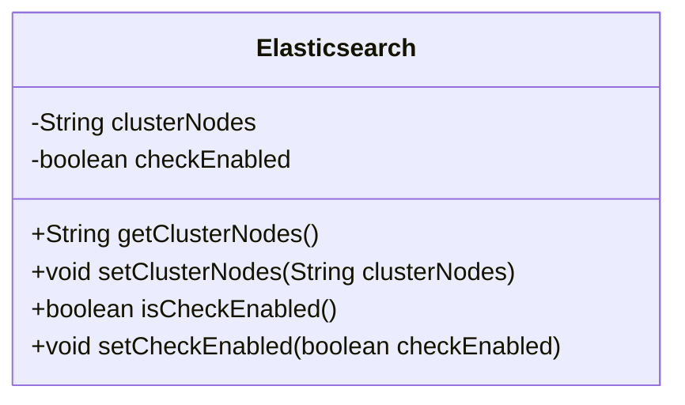
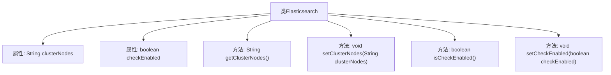

# 基础信息

|      |      |
|------|------|
| 名称 | Elasticsearch |
| 编码语言 | .java |
| 代码路径 | JeecgBoot/jeecg-boot/jeecg-boot-base-core/src/main/java/org/jeecg/config/vo/Elasticsearch.java |
| 包名 | org.jeecg.config.vo |
| 依赖项 | [] |
| 概述说明 | Elasticsearch类包含集群节点属性及检查启用状态方法。 |

# 说明

Elasticsearch类包含用于管理集群节点和检查启用状态的属性及其相关方法。该类提供了对集群节点的操作功能，包括节点的添加、删除和查询等。同时，它还具备检查系统或服务是否启用的方法，确保在需要时能够准确判断当前状态。这些属性和方法共同构成了Elasticsearch类的核心功能，支持对集群和系统状态的有效管理。

# 类列表 Class Summary

| 名称   | 类型  | 说明 |
|-------|------|-------------|
| Elasticsearch | class | Elasticsearch类包含集群节点和检查启用状态的属性及其方法。 |

## 类 Elasticsearch

|      |      |
|------|------|
| 访问范围 | public |
| 类型 | class |
| 名称 | Elasticsearch |
| 说明 | Elasticsearch类包含集群节点和检查启用状态的属性及其方法。 |

### UML类图

这段代码定义了一个名为 `Elasticsearch` 的类，该类包含两个私有成员变量：`clusterNodes` 和 `checkEnabled`。`clusterNodes` 用于存储集群节点的信息，`checkEnabled` 用于标识是否启用了检查功能。类中提供了四个公有方法：`getClusterNodes` 和 `setClusterNodes` 用于获取和设置 `clusterNodes` 的值，`isCheckEnabled` 和 `setCheckEnabled` 用于获取和设置 `checkEnabled` 的值。这个类主要用于管理和操作 Elasticsearch 集群的配置信息。

### 内部方法调用关系图

该流程图展示了`Elasticsearch`类的结构和其内部方法的关系。`Elasticsearch`类包含两个私有属性：`clusterNodes`和`checkEnabled`，并提供了相应的getter和setter方法。通过该图，可以清晰地看到类中属性的访问和修改方式，以及这些方法如何与类本身关联。

### 字段列表 Field List

| 名称  | 类型  | 说明 |
|-------|-------|------|
| clusterNodes | String | 定义私有字符串变量clusterNodes。 |
| checkEnabled | boolean | 私有布尔变量checkEnabled用于检查功能是否启用。 |

### 方法列表 Method List

| 名称  | 类型  | 说明 |
|-------|-------|------|
| getClusterNodes | String | 获取集群节点信息的方法。 |
| setCheckEnabled | void | 设置检查启用状态的公共方法。 |
| isCheckEnabled | boolean | 该方法返回布尔值，表示检查是否启用。 |
| setClusterNodes | void | 设置集群节点的方法，将参数赋值给类变量。 |

