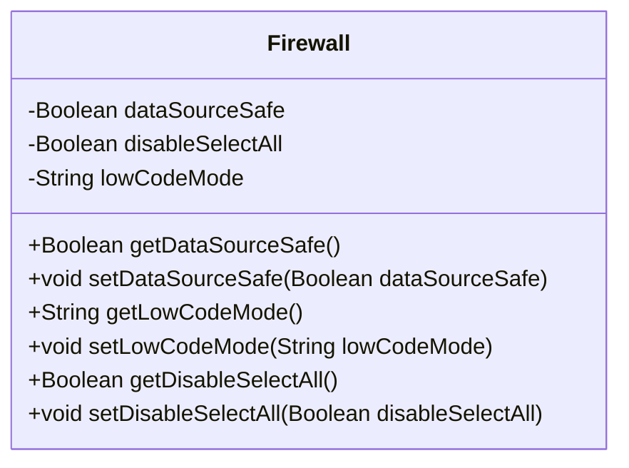
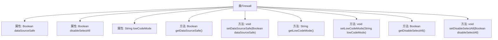

# 基础信息

|      |      |
|------|------|
| 名称 | Firewall |
| 编码语言 | .java |
| 代码路径 | JeecgBoot/jeecg-boot/jeecg-boot-base-core/src/main/java/org/jeecg/config/vo/Firewall.java |
| 包名 | org.jeecg.config.vo |
| 依赖项 | [] |
| 概述说明 | 防火墙类涵盖数据源安全、全字段查询限制及低代码配置。 |

# 说明

防火墙类涵盖了数据源安全、禁止全字段查询和低代码模式配置三个关键功能。数据源安全确保数据访问的合法性和安全性，防止未经授权的访问。禁止全字段查询功能限制了对数据库中所有字段的查询，避免数据泄露和性能问题。低代码模式配置简化了防火墙的设置和管理，降低了技术门槛，使非专业用户也能轻松配置和维护防火墙。

# 类列表 Class Summary

| 名称   | 类型  | 说明 |
|-------|------|-------------|
| Firewall | class | 防火墙类包含数据源安全、禁止全字段查询和低代码模式配置。 |

## 类 Firewall

|      |      |
|------|------|
| 访问范围 | public |
| 类型 | class |
| 名称 | Firewall |
| 说明 | 防火墙类包含数据源安全、禁止全字段查询和低代码模式配置。 |

### UML类图

这段代码定义了一个名为 `Firewall` 的类，用于管理防火墙的相关配置。类中包含三个私有属性：`dataSourceSafe`（数据源安全）、`disableSelectAll`（是否禁止使用 * 查询所有字段）和 `lowCodeMode`（低代码模式）。每个属性都有对应的 getter 和 setter 方法，用于获取和设置这些属性的值。通过这些方法，可以灵活地配置和管理防火墙的行为。

### 内部方法调用关系图

这段代码定义了一个名为`Firewall`的类，包含三个属性：`dataSourceSafe`、`disableSelectAll`和`lowCodeMode`，分别用于控制数据源安全、是否禁止使用`*`查询所有字段以及低代码模式。类中提供了这些属性的getter和setter方法，用于获取和设置它们的值。流程图展示了类结构及其内部方法的调用关系，清晰地反映了类的属性和方法之间的关联。

### 字段列表 Field List

| 名称  | 类型  | 说明 |
|-------|-------|------|
| lowCodeMode | String | 低代码模式私有字符串变量。 |
| disableSelectAll = false | Boolean | 禁用全选功能的布尔变量。 |
| dataSourceSafe = false | Boolean | 私有布尔变量dataSourceSafe初始值为false。 |

### 方法列表 Method List

| 名称  | 类型  | 说明 |
|-------|-------|------|
| getLowCodeMode | String | 获取低代码模式的方法。 |
| setDisableSelectAll | void | 设置禁用全选功能的布尔值。 |
| getDisableSelectAll | Boolean | 方法返回布尔值disableSelectAll。 |
| setDataSourceSafe | void | 设置数据源安全状态的公共方法。 |
| setLowCodeMode | void | 设置低代码模式的字符串值。 |
| getDataSourceSafe | Boolean | 方法返回数据源安全状态。 |

