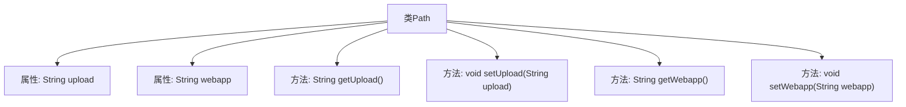

# 基础信息

|      |      |
|------|------|
| 名称 | Path |
| 编码语言 | .java |
| 代码路径 | JeecgBoot/jeecg-boot/jeecg-boot-base-core/src/main/java/org/jeecg/config/vo/Path.java |
| 包名 | org.jeecg.config.vo |
| 依赖项 | ['javax.print.DocFlavor'] |
| 概述说明 | Path类含upload和webapp属性，提供getter和setter方法。 |

# 说明

Path类包含两个字符串属性，分别是upload和webapp。该类为这两个属性提供了getter和setter方法，用于获取和设置它们的值。这些方法允许外部代码访问和修改upload和webapp属性的内容，确保对这两个属性的操作是可控和安全的。

# 类列表 Class Summary

| 名称   | 类型  | 说明 |
|-------|------|-------------|
| Path | class | Path类包含upload和webapp两个字符串属性，提供getter和setter方法。 |

## 类 Path

|      |      |
|------|------|
| 访问范围 | public |
| 类型 | class |
| 名称 | Path |
| 说明 | Path类包含upload和webapp两个字符串属性，提供getter和setter方法。 |

### UML类图

这段代码定义了一个名为 `Path` 的类，该类包含两个私有成员变量 `upload` 和 `webapp`，分别用于存储上传路径和 web 应用路径。类中提供了四个公有方法：`getUpload` 和 `getWebapp` 用于获取这两个变量的值，`setUpload` 和 `setWebapp` 用于设置这两个变量的值。该类的主要作用是管理和操作与路径相关的数据。

### 内部方法调用关系图

这段代码定义了一个名为`Path`的类，包含两个私有属性`upload`和`webapp`，以及对应的getter和setter方法。`getUpload()`和`getWebapp()`方法用于获取属性的值，而`setUpload(String upload)`和`setWebapp(String webapp)`方法用于设置属性的值。这些方法提供了对私有属性的访问和修改的接口，确保了类的封装性。

### 字段列表 Field List

| 名称  | 类型  | 说明 |
|-------|-------|------|
| upload | String | 定义了一个私有的字符串类型变量upload。 |
| webapp | String | 定义了一个私有的字符串变量webapp。 |

### 方法列表 Method List

| 名称  | 类型  | 说明 |
|-------|-------|------|
| setUpload | void | 设置上传文件路径的方法。 |
| setWebapp | void | 该方法用于设置webapp属性的值。 |
| getUpload | String | 获取上传数据的字符串方法。 |
| getWebapp | String | 该方法返回webapp变量的值。 |

