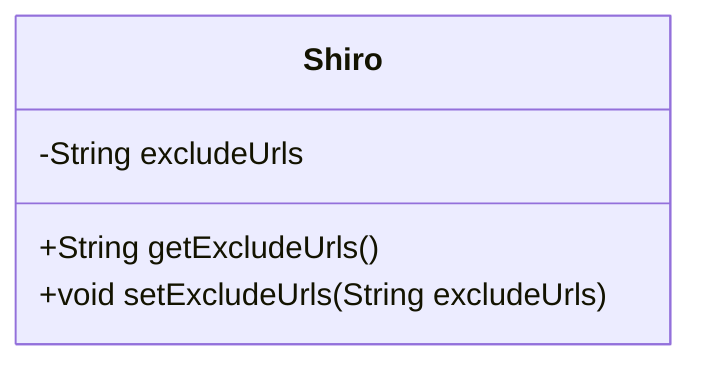
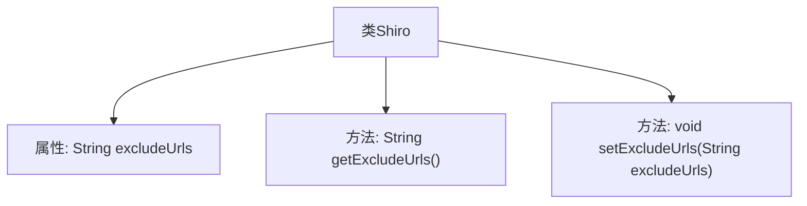

# 基础信息

|      |      |
|------|------|
| 名称 | Shiro |
| 编码语言 | .java |
| 代码路径 | JeecgBoot/jeecg-boot/jeecg-boot-base-core/src/main/java/org/jeecg/config/vo/Shiro.java |
| 包名 | org.jeecg.config.vo |
| 依赖项 | [] |
| 概述说明 | Shiro类含私有属性excludeUrls及其getter和setter方法。 |

# 说明

Shiro类中定义了一个私有属性excludeUrls，该属性用于存储排除的URL列表。为了方便外部访问和修改这个属性，类中还提供了相应的getter和setter方法。getter方法用于获取excludeUrls的值，而setter方法则用于设置或更新excludeUrls的值。这种设计遵循了封装的原则，确保属性的访问和修改通过方法进行，增强了代码的安全性和可维护性。

# 类列表 Class Summary

| 名称   | 类型  | 说明 |
|-------|------|-------------|
| Shiro | class | Shiro类包含私有属性excludeUrls及其getter和setter方法。 |

## 类 Shiro

|      |      |
|------|------|
| 访问范围 | public |
| 类型 | class |
| 名称 | Shiro |
| 说明 | Shiro类包含私有属性excludeUrls及其getter和setter方法。 |

### UML类图

这段代码定义了一个名为 `Shiro` 的类，该类包含一个私有成员变量 `excludeUrls`，用于存储排除的URL字符串。类中提供了两个公有方法：`getExcludeUrls` 用于获取 `excludeUrls` 的值，`setExcludeUrls` 用于设置 `excludeUrls` 的值。这个类主要用于管理和操作排除的URL列表，适用于需要动态调整或获取排除URL的场景。

### 内部方法调用关系图

这段代码定义了一个名为`Shiro`的类，其中包含一个私有属性`excludeUrls`，以及两个公共方法`getExcludeUrls`和`setExcludeUrls`。`getExcludeUrls`方法用于获取`excludeUrls`的值，而`setExcludeUrls`方法用于设置`excludeUrls`的值。流程图展示了类与属性及方法之间的关系，清晰地描述了类的结构和功能。

### 字段列表 Field List

| 名称  | 类型  | 说明 |
|-------|-------|------|
| excludeUrls = "" | String | 定义私有字符串变量excludeUrls并初始化为空。 |

### 方法列表 Method List

| 名称  | 类型  | 说明 |
|-------|-------|------|
| setExcludeUrls | void | 设置排除URL的字符串参数。 |
| getExcludeUrls | String | 获取排除的URL字符串方法。 |

