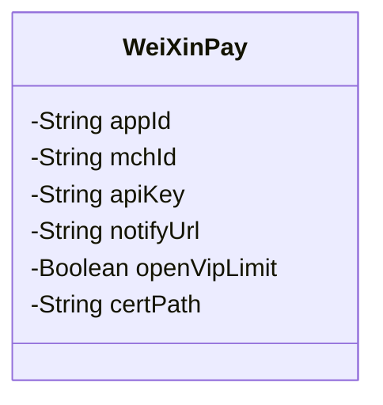
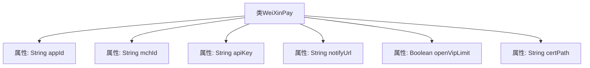

# 基础信息

|      |      |
|------|------|
| 名称 | WeiXinPay |
| 编码语言 | .java |
| 代码路径 | JeecgBoot/jeecg-boot/jeecg-boot-base-core/src/main/java/org/jeecg/config/vo/WeiXinPay.java |
| 包名 | org.jeecg.config.vo |
| 依赖项 | ['lombok.Data'] |
| 概述说明 | 微信支付类含公众号ID、商户号ID、秘钥、回调地址、会员认证开关和证书路径。 |

# 说明

微信支付类包含多个关键属性，包括公众号ID、商户号ID、秘钥、回调地址、会员认证开关和证书路径。这些属性分别用于标识公众号和商户、进行安全验证、处理支付回调、控制会员认证功能以及指定证书文件的位置。

# 类列表 Class Summary

| 名称   | 类型  | 说明 |
|-------|------|-------------|
| WeiXinPay | class | 微信支付类包含公众号ID、商户号ID、秘钥、回调地址、会员认证开关和证书路径。 |

## 类 WeiXinPay

|      |      |
|------|------|
| 访问范围 | @Data;public |
| 类型 | class |
| 名称 | WeiXinPay |
| 说明 | 微信支付类包含公众号ID、商户号ID、秘钥、回调地址、会员认证开关和证书路径。 |

### UML类图

类图描述：  
`WeiXinPay` 类是一个用于处理微信支付相关信息的类，包含了微信公众号ID、商户号ID、商户号秘钥、回调地址、是否开启会员认证以及证书路径等私有属性。这些属性用于配置微信支付的相关参数，确保支付流程的正确执行。类图清晰地展示了这些属性的访问权限和类型，帮助开发者理解类的结构和功能。

### 内部方法调用关系图

这段代码定义了一个名为 `WeiXinPay` 的类，包含了与微信支付相关的多个属性，如微信公众号ID、商户号ID、商户号秘钥、回调地址、是否开启会员认证以及证书路径。这些属性用于配置和管理微信支付的相关信息，确保支付功能的正常运行和安全控制。

### 字段列表 Field List

| 名称  | 类型  | 说明 |
|-------|-------|------|
| mchId | String | 私有字符串变量mchId。 |
| apiKey | String | 声明一个私有字符串变量apiKey。 |
| notifyUrl | String | 定义了私有字符串变量notifyUrl。 |
| openVipLimit | Boolean | 该变量用于控制VIP功能是否开启限制。 |
| appId | String | 定义了一个私有字符串变量appId。 |
| certPath | String | 私有字符串变量certPath，用于存储证书路径。 |

### 方法列表 Method List

| 名称  | 类型  | 说明 |
|-------|-------|------|

