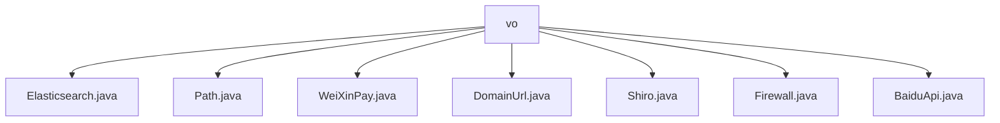

# 基础信息

|      |      |
|------|------|
| 名称 | vo |
| 编码语言 | .java |
| 代码路径 | JeecgBoot/jeecg-boot/jeecg-boot-base-core/src/main/java/org/jeecg/config/vo |
| 包名 | JeecgBoot.jeecg-boot.jeecg-boot-base-core.src.main.java.org.jeecg.config.vo |
| 概述说明 | Elasticsearch类管理集群节点和检查状态，Path类处理upload和webapp属性，微信支付类包含支付相关属性，DomainUrl类存储PC和app端URL，Shiro类管理排除URL列表，防火墙类涵盖数据源安全和查询限制，BaiduApi类确保API调用安全。 |

# 说明

## 概述
该代码模块主要包含多个配置类，用于管理和存储与系统、服务和第三方API相关的配置信息。这些类通过封装属性和提供访问方法，确保配置数据的安全性和可维护性。模块的核心功能包括集群节点管理、路径配置、支付信息管理、域名URL存储、安全配置、防火墙规则以及API认证等。这些类共同构成了一个灵活且安全的配置管理系统，支持系统在不同业务场景下的高效运行。

## 主要业务场景
1. **集群节点管理**：通过`Elasticsearch`类，系统可以动态管理Elasticsearch集群的节点，包括节点的添加、删除和查询，同时检查服务启用状态，确保集群的稳定性和可用性。
2. **路径配置**：`Path`类用于管理文件上传路径和Web应用路径，确保文件操作和Web资源的访问路径是可控和安全的。
3. **支付信息管理**：`WeiXinPay`类存储微信支付相关的关键信息，如公众号ID、商户号ID、秘钥和回调地址，支持支付功能的正常运行和安全验证。
4. **域名URL管理**：`DomainUrl`类存储PC端和移动应用端的域名URL，确保不同终端的URL配置是独立且可维护的。
5. **安全配置**：`Shiro`类管理排除的URL列表，支持系统在安全框架下的灵活配置，避免不必要的安全验证。
6. **防火墙规则配置**：`Firewall`类提供数据源安全、禁止全字段查询和低代码模式配置功能，确保数据库访问的安全性和性能优化。
7. **API认证管理**：`BaiduApi`类存储百度API的认证信息，如appId、apiKey和secretKey，确保API调用的安全性和正确性。

这些业务场景涵盖了系统配置、安全管理、支付处理和API集成等多个方面，支持系统在复杂环境下的高效运行和扩展。

### 包内部结构视图

该流程图展示了`vo`文件夹下的所有文件层级关系。`vo`作为根节点，包含了多个配置文件，如`Elasticsearch.java`、`Path.java`、`WeiXinPay.java`等。每个文件都直接隶属于`vo`文件夹，没有进一步的子文件夹结构。这种层级关系清晰地反映了配置文件的组织方式，便于开发者快速定位和管理相关配置。

# 文件列表 File List

| 名称   | 类型  | 说明 |
|-------|------|-------------|
| [BaiduApi.java](BaiduApi.md) | file | BaiduApi类有三个私有属性：appId、apiKey和secretKey。 |
| [Shiro.java](Shiro.md) | file | Shiro类含私有属性excludeUrls及其getter和setter方法。 |
| [Firewall.java](Firewall.md) | file | 防火墙类涵盖数据源安全、全字段查询限制及低代码配置。 |
| [DomainUrl.java](DomainUrl.md) | file | DomainUrl类包含pc和app两个私有字符串属性。 |
| [WeiXinPay.java](WeiXinPay.md) | file | 微信支付类含公众号ID、商户号ID、秘钥、回调地址、会员认证开关和证书路径。 |
| [Path.java](Path.md) | file | Path类含upload和webapp属性，提供getter和setter方法。 |
| [Elasticsearch.java](Elasticsearch.md) | file | Elasticsearch类包含集群节点属性及检查启用状态方法。 |

