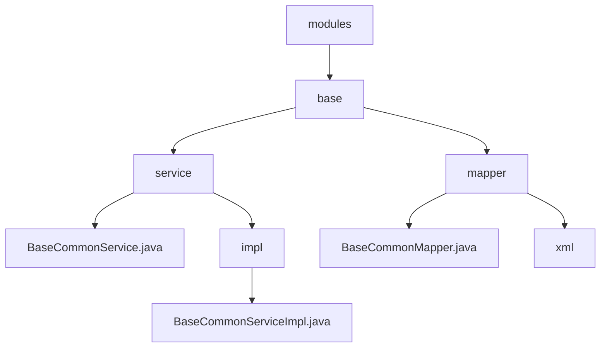

# 基础信息

|      |      |
|------|------|
| 名称 | modules |
| 编码语言 | .java |
| 代码路径 | JeecgBoot/jeecg-boot/jeecg-boot-base-core/src/main/java/org/jeecg/modules |
| 包名 | JeecgBoot.jeecg-boot.jeecg-boot-base-core.src.main.java.org.jeecg.modules |
| 概述说明 | JeecgBoot的`jeecg-boot-base-core`模块提供异常日志记录功能，提升系统稳定性和问题排查效率。 |

# 说明

## 概述
该代码模块属于JeecgBoot项目中的`jeecg-boot-base-core`模块，主要提供了基础的公共服务功能。其核心组件包括`BaseCommonService`接口及其实现类`BaseCommonServiceImpl`，这些组件负责处理异常日志的记录和保存。该模块的主要目标是确保系统在运行过程中能够及时捕捉异常信息，并将其记录到日志中，以便后续的排查和分析，从而提升系统的稳定性和可靠性。

## 主要业务场景
1. **异常日志记录**：在系统运行过程中，`BaseCommonServiceImpl`类负责捕捉异常情况，并将相关的日志信息保存到系统中。这一功能确保了系统在遇到错误时能够及时记录，便于开发人员或运维人员进行问题排查。
2. **系统监控与维护**：通过记录异常日志，系统能够更有效地监控其运行状态，及时发现潜在问题，并进行相应的维护和修复，从而提升系统的整体稳定性和可靠性。
3. **问题排查与分析**：保存的日志信息为后续的问题排查和分析提供了重要依据，帮助开发人员快速定位和解决系统运行中的问题。

### 包内部结构视图

该流程图展示了JeecgBoot项目中`jeecg-boot-base-core`模块的目录结构。`modules`目录下包含`base`子目录，`base`目录下进一步分为`service`和`mapper`两个子目录。`service`目录中包含`BaseCommonService.java`文件以及`impl`子目录，`impl`子目录中包含了`BaseCommonServiceImpl.java`文件。`mapper`目录下包含`BaseCommonMapper.java`文件和`xml`子目录。

# 文件列表 File List

| 名称   | 类型  | 说明 |
|-------|------|-------------|
| [base](base/_module.md) | package | JeecgBoot的`jeecg-boot-base-core`模块提供异常日志记录功能，提升系统稳定性和问题排查效率。 |

