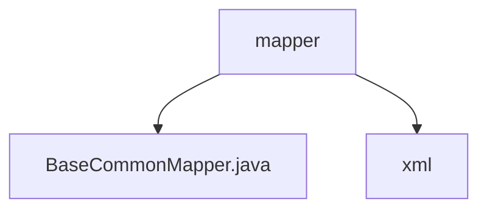

# 基础信息

|      |      |
|------|------|
| 名称 | mapper |
| 编码语言 | .java |
| 代码路径 | JeecgBoot/jeecg-boot/jeecg-boot-base-core/src/main/java/org/jeecg/modules/base/mapper |
| 包名 | JeecgBoot.jeecg-boot.jeecg-boot-base-core.src.main.java.org.jeecg.modules.base.mapper |
| 概述说明 | 信息为空，无法生成概要描述。 |

# 说明

由于提供的输入内容为空，无法进行总结描述。请提供具体内容以便生成详尽的描述。

### 包内部结构视图

该流程图展示了`mapper`文件夹的层级结构，其中包含`BaseCommonMapper.java`文件和`xml`子文件夹。`mapper`作为根节点，直接连接了两个子节点，清晰地反映了路径的层级关系。

# 文件列表 File List

| 名称   | 类型  | 说明 |
|-------|------|-------------|
| [BaseCommonMapper.java](BaseCommonMapper.md) | file | 信息为空，无法生成概要描述。 |
| [xml](xml/_module.md) | package | None |

