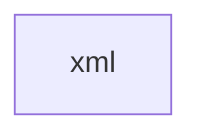

# 基础信息

|      |      |
|------|------|
| 名称 | xml |
| 编码语言 | .java |
| 代码路径 | JeecgBoot/jeecg-boot/jeecg-boot-base-core/src/main/java/org/jeecg/modules/base/mapper/xml |
| 包名 | JeecgBoot.jeecg-boot.jeecg-boot-base-core.src.main.java.org.jeecg.modules.base.mapper.xml |
| 概述说明 | None |

# 说明

None

### 包内部结构视图

描述：该流程图展示了一个简单的层级关系，路径的最终节点是“xml”，它位于“mapper”目录下。此路径仅包含一个节点，表示最终的文件夹或文件名称。

# 文件列表 File List

| 名称   | 类型  | 说明 |
|-------|------|-------------|

