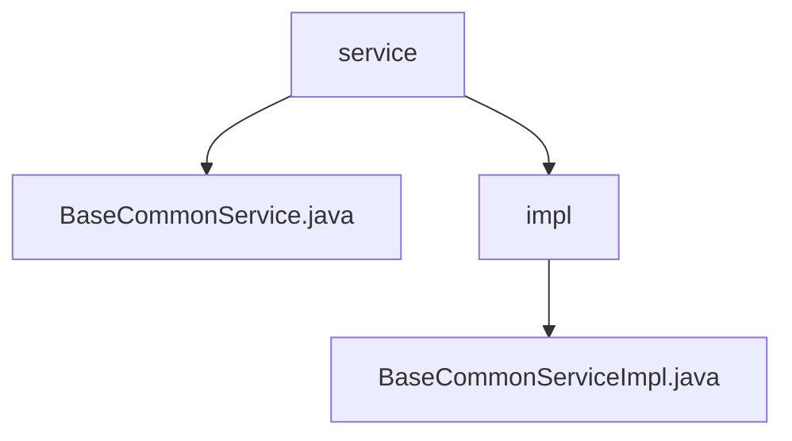

# 基础信息

|      |      |
|------|------|
| 名称 | service |
| 编码语言 | .java |
| 代码路径 | JeecgBoot/jeecg-boot/jeecg-boot-base-core/src/main/java/org/jeecg/modules/base/service |
| 包名 | JeecgBoot.jeecg-boot.jeecg-boot-base-core.src.main.java.org.jeecg.modules.base.service |
| 概述说明 | BaseCommonServiceImpl类实现日志功能，记录异常信息，提升系统稳定性和可靠性。 |

# 说明

## 概述
该代码模块属于JeecgBoot项目中的`jeecg-boot-base-core`模块，主要提供了基础的公共服务功能。其中，`BaseCommonService`接口及其实现类`BaseCommonServiceImpl`负责处理异常日志的记录和保存。该模块的核心目标是确保系统在运行过程中能够及时捕捉异常信息，并将其记录到日志中，以便后续的排查和分析，从而提升系统的稳定性和可靠性。

## 主要业务场景
1. **异常日志记录**：在系统运行过程中，`BaseCommonServiceImpl`类负责捕捉异常情况，并将相关的日志信息保存到系统中。这一功能确保了系统在遇到错误时能够及时记录，便于开发人员或运维人员进行问题排查。
2. **系统监控与维护**：通过记录异常日志，系统能够更有效地监控其运行状态，及时发现潜在问题，并进行相应的维护和修复，从而提升系统的整体稳定性和可靠性。
3. **问题排查与分析**：保存的日志信息为后续的问题排查和分析提供了重要依据，帮助开发人员快速定位和解决系统运行中的问题。

### 包内部结构视图

该流程图展示了 `service` 文件夹与其子文件和子文件夹的层级关系。`service` 文件夹包含一个文件 `BaseCommonService.java` 和一个子文件夹 `impl`，而 `impl` 文件夹中又包含一个文件 `BaseCommonServiceImpl.java`。这种结构清晰地反映了代码的组织方式，便于理解和管理。

# 文件列表 File List

| 名称   | 类型  | 说明 |
|-------|------|-------------|
| [BaseCommonService.java](BaseCommonService.md) | file | 无内容，无法生成概要描述。 |
| [impl](impl/_module.md) | package | BaseCommonServiceImpl类实现日志功能，处理异常并保存日志信息。 |

