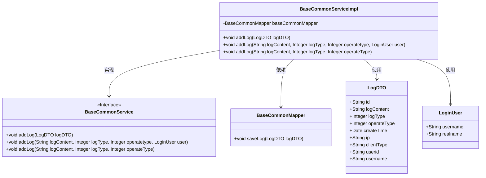
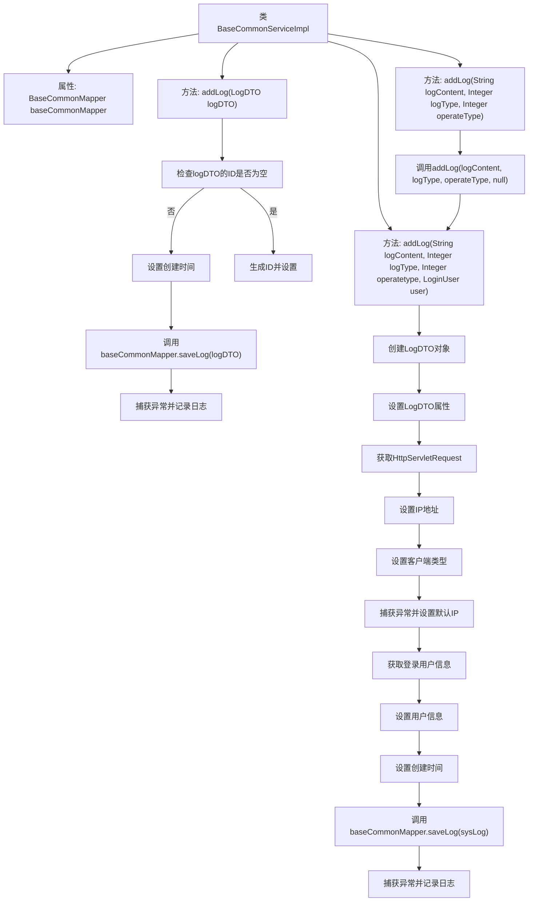

# 基础信息

|      |      |
|------|------|
| 名称 | BaseCommonServiceImpl |
| 编码语言 | .java |
| 代码路径 | JeecgBoot/jeecg-boot/jeecg-boot-base-core/src/main/java/org/jeecg/modules/base/service/impl/BaseCommonServiceImpl.java |
| 包名 | org.jeecg.modules.base.service.impl |
| 依赖项 | ['com.baomidou.mybatisplus.core.toolkit.IdWorker', 'lombok.extern.slf4j.Slf4j', 'org.apache.shiro.SecurityUtils', 'org.jeecg.common.api.dto.LogDTO', 'org.jeecg.common.constant.enums.ClientTerminalTypeEnum', 'org.jeecg.common.util.BrowserUtils', 'org.jeecg.modules.base.mapper.BaseCommonMapper', 'org.jeecg.modules.base.service.BaseCommonService', 'org.jeecg.common.system.vo.LoginUser', 'org.jeecg.common.util.IpUtils', 'org.jeecg.common.util.SpringContextUtils', 'org.jeecg.common.util.oConvertUtils', 'org.springframework.stereotype.Service', 'javax.annotation.Resource', 'javax.servlet.http.HttpServletRequest', 'java.util'] |
| 概述说明 | BaseCommonServiceImpl类实现日志功能，处理异常并保存日志信息。 |

# 说明

BaseCommonServiceImpl类实现了日志添加功能，主要用于处理异常情况并将相关的日志信息进行保存。该功能确保在系统运行过程中，能够及时捕捉并记录异常信息，便于后续的排查和分析。通过这一机制，系统可以更有效地监控和维护其运行状态，提升整体的稳定性和可靠性。

# 类列表 Class Summary

| 名称   | 类型  | 说明 |
|-------|------|-------------|
| BaseCommonServiceImpl | class | BaseCommonServiceImpl类实现日志添加功能，处理异常并保存日志信息。 |

## 类 BaseCommonServiceImpl

|      |      |
|------|------|
| 访问范围 | @Service;@Slf4j;public |
| 类型 | class |
| 名称 | BaseCommonServiceImpl |
| 说明 | BaseCommonServiceImpl类实现日志添加功能，处理异常并保存日志信息。 |

### UML类图

### 描述
`BaseCommonServiceImpl`类实现了`BaseCommonService`接口，主要负责日志的添加操作。它依赖于`BaseCommonMapper`来保存日志数据，并使用`LogDTO`和`LoginUser`类来传递日志信息和用户信息。该类通过多个重载的`addLog`方法处理不同类型的日志添加请求，并在日志保存过程中进行异常捕获，以防止日志数据过大导致业务失败。

### 内部方法调用关系图

这段代码定义了一个`BaseCommonServiceImpl`类，实现了`BaseCommonService`接口，主要用于日志的添加和处理。代码包含三个主要方法：`addLog(LogDTO logDTO)`、`addLog(String logContent, Integer logType, Integer operatetype, LoginUser user)`和`addLog(String logContent, Integer logType, Integer operateType)`。每个方法都涉及日志的创建、属性设置、异常处理以及日志的保存。代码通过捕获异常来确保日志记录不会因为数据过大或其他问题导致业务失败，并且通过不同的方法重载来支持多种日志添加方式。

### 字段列表 Field List

| 名称  | 类型  | 说明 |
|-------|-------|------|
| baseCommonMapper | BaseCommonMapper | 私有成员变量baseCommonMapper类型为BaseCommonMapper。 |

### 方法列表 Method List

| 名称  | 类型  | 说明 |
|-------|-------|------|
| addLog | void | 重写addLog方法，支持日志内容、类型和操作类型参数。 |
| addLog | void | 方法添加日志，自动生成ID，捕获异常防止存储失败。 |
| addLog | void | 方法添加日志，设置内容、类型、操作类型、IP、客户端、用户信息并保存。 |

