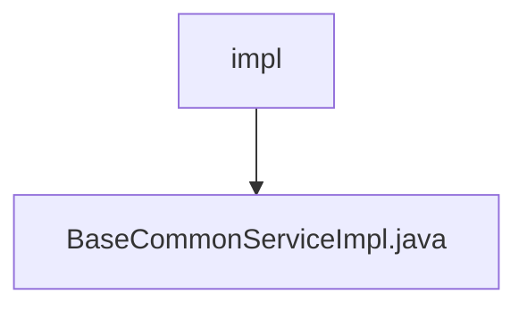

# 基础信息

|      |      |
|------|------|
| 名称 | impl |
| 编码语言 | .java |
| 代码路径 | JeecgBoot/jeecg-boot/jeecg-boot-base-core/src/main/java/org/jeecg/modules/base/service/impl |
| 包名 | JeecgBoot.jeecg-boot.jeecg-boot-base-core.src.main.java.org.jeecg.modules.base.service.impl |
| 概述说明 | BaseCommonServiceImpl类实现日志功能，处理异常并保存日志信息。 |

# 说明

BaseCommonServiceImpl类实现了日志添加功能，主要用于处理异常情况并将相关的日志信息进行保存。该功能确保在系统运行过程中，能够及时捕捉并记录异常信息，便于后续的排查和分析。通过这一机制，系统可以更有效地监控和维护其运行状态，提升整体的稳定性和可靠性。

### 包内部结构视图

该流程图展示了`impl`文件夹与`BaseCommonServiceImpl.java`文件之间的层级关系。`impl`是`BaseCommonServiceImpl.java`文件的父级目录，文件位于该目录下。整个结构简洁明了，清晰地反映了文件在项目中的位置。

# 文件列表 File List

| 名称   | 类型  | 说明 |
|-------|------|-------------|
| [BaseCommonServiceImpl.java](BaseCommonServiceImpl.md) | file | BaseCommonServiceImpl类实现日志功能，处理异常并保存日志信息。 |

