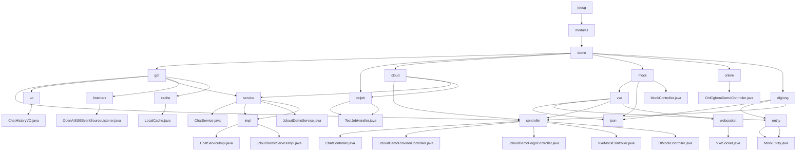

# 基础信息

|      |      |
|------|------|
| 名称 | jeecg |
| 编码语言 | .java |
| 代码路径 | JeecgBoot/jeecg-boot/jeecg-module-demo/src/main/java/org/jeecg |
| 包名 | JeecgBoot.jeecg-boot.jeecg-module-demo.src.main.java.org.jeecg |
| 概述说明 | JeecgBoot模块集成了聊天、微服务、数据模拟、实时通信和表单处理功能。 |

# 说明

## 概述

该代码模块是一个基于JeecgBoot框架的多功能模块集合，涵盖了聊天服务、微服务架构示例、模拟数据管理、实时通信以及表单增强功能等多个方面。模块通过多个子模块和组件，展示了JeecgBoot框架在不同业务场景下的应用，包括与GPT模型的实时交互、微服务架构中的控制器与服务层交互、模拟数据操作、WebSocket通信以及表单数据处理等。每个子模块都通过特定的类和接口实现其功能，确保系统的高效性、稳定性和可扩展性。

此外，模块还包含两个核心部分：`MockEntity`类和`DlMockController`控制器。`MockEntity`类用于定义和管理实体的基本结构，包括实体的唯一标识、父级实体标识以及当前状态。`DlMockController`控制器则负责模拟数据的更改、保存及查询操作，并通过Socket实现数据的实时更新和交互。这两个组件共同构成了一个模拟数据管理的模块，能够有效地处理实体的层级关系和状态信息，并通过网络通信机制实现数据的传输与同步。

## 主要业务场景

1. **聊天服务**  
   - 实现与GPT模型的实时交互，包括建立SSE连接、处理用户消息、保存和检索聊天记录、以及异常处理。确保聊天过程的高效性和数据完整性。

2. **微服务架构示例**  
   - 展示控制器与服务层之间的交互方式，通过简单的问候服务演示微服务架构中的模块化设计和分层交互。

3. **模拟数据管理**  
   - 使用`MockEntity`类管理具有层级关系和状态信息的实体，通过`VxeMockController`和`DlMockController`实现模拟数据的更改和查询，支持状态管理、拖轮控制和进度条显示等功能。

4. **实时通信**  
   - 通过`VxeSocket`类管理WebSocket连接，支持多页面之间的消息传递和事件处理，适用于需要高效通信和事件管理的多页面应用场景。`DlMockController`控制器利用Socket进行数据传输，确保数据的实时更新和交互，适用于需要通过网络进行数据同步和通信的业务场景。

5. **表单增强功能**  
   - 使用`OnlCgformDemoController`处理表单数据的校验和修改，确保表单数据的准确性和完整性，并支持对现有表单数据的修改操作。

通过这些功能，该模块为用户提供了多样化的业务场景支持，涵盖了从实时聊天到数据管理、从微服务架构到表单处理的多个方面，展示了JeecgBoot框架的强大功能和灵活性。

### 包内部结构视图

该流程图展示了JeecgBoot项目中`jeecg-module-demo`模块的目录结构及其层级关系。从根目录`jeecg`开始，逐步展开到各个子模块，如`gpt`、`cloud`、`mock`等，并进一步细化到具体的控制器、服务、实体类等文件。每个节点仅显示路径的最后一级元素，清晰地反映了项目中的文件组织方式。

# 文件列表 File List

| 名称   | 类型  | 说明 |
|-------|------|-------------|
| [modules](modules/_module.md) | package | JeecgBoot模块集成了聊天、微服务、数据模拟、实时通信和表单处理功能。 |

