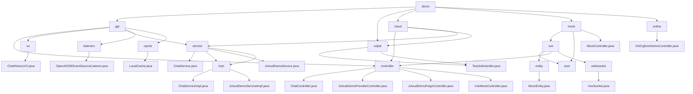

# 基础信息

|      |      |
|------|------|
| 名称 | demo |
| 编码语言 | .java |
| 代码路径 | JeecgBoot/jeecg-boot/jeecg-module-demo/src/main/java/org/jeecg/modules/demo |
| 包名 | JeecgBoot.jeecg-boot.jeecg-module-demo.src.main.java.org.jeecg.modules.demo |
| 概述说明 | 基于JeecgBoot框架的聊天服务模块，实现与GPT模型的实时交互，管理聊天记录和系统稳定性。 |

# 说明

## 概述

该代码模块是一个基于JeecgBoot框架的多功能模块集合，涵盖了聊天服务、微服务架构示例、模拟数据管理、实时通信以及表单增强功能等多个方面。模块通过多个子模块和组件，展示了JeecgBoot框架在不同业务场景下的应用，包括与GPT模型的实时交互、微服务架构中的控制器与服务层交互、模拟数据操作、WebSocket通信以及表单数据处理等。每个子模块都通过特定的类和接口实现其功能，确保系统的高效性、稳定性和可扩展性。

## 主要业务场景

1. **聊天服务**  
   - 实现与GPT模型的实时交互，包括建立SSE连接、处理用户消息、保存和检索聊天记录、以及异常处理。确保聊天过程的高效性和数据完整性。

2. **微服务架构示例**  
   - 展示控制器与服务层之间的交互方式，通过简单的问候服务演示微服务架构中的模块化设计和分层交互。

3. **模拟数据管理**  
   - 使用`MockEntity`类管理具有层级关系和状态信息的实体，通过`VxeMockController`实现模拟数据的更改和查询，支持状态管理、拖轮控制和进度条显示等功能。

4. **实时通信**  
   - 通过`VxeSocket`类管理WebSocket连接，支持多页面之间的消息传递和事件处理，适用于需要高效通信和事件管理的多页面应用场景。

5. **表单增强功能**  
   - 使用`OnlCgformDemoController`处理表单数据的校验和修改，确保表单数据的准确性和完整性，并支持对现有表单数据的修改操作。

通过这些功能，该模块为用户提供了多样化的业务场景支持，涵盖了从实时聊天到数据管理、从微服务架构到表单处理的多个方面，展示了JeecgBoot框架的强大功能和灵活性。

### 包内部结构视图

该流程图展示了 `demo` 模块下的多个子模块及其相关文件的结构关系。`demo` 模块包含 `gpt`、`xxljob`、`cloud`、`mock` 和 `online` 等子模块，每个子模块下又包含多个控制器、服务、实体类等文件。通过该图可以清晰地看到各模块之间的层级关系和文件分布。

# 文件列表 File List

| 名称   | 类型  | 说明 |
|-------|------|-------------|
| [online](online/_module.md) | package | OnlCgformDemoController负责表单增强，涵盖列表处理、校验及修改功能。 |
| [mock](mock/_module.md) | package | 代码模块包含MockEntity、VxeMockController和VxeSocket，支持层级关系管理、实时数据模拟和多页面通信。 |
| [cloud](cloud/_module.md) | package | 该模块展示JeecgBoot框架下控制器与服务层交互，实现消息获取和个性化问候功能。 |
| [xxljob](xxljob/_module.md) | package | 信息为空，无法生成概要描述。 |
| [gpt](gpt/_module.md) | package | ChatController管理聊天功能，ChatHistoryVO存储聊天记录，ChatServiceImpl处理GPT交互，OpenAISSEEventSourceListener处理SSE事件，本地缓存优化性能。 |

