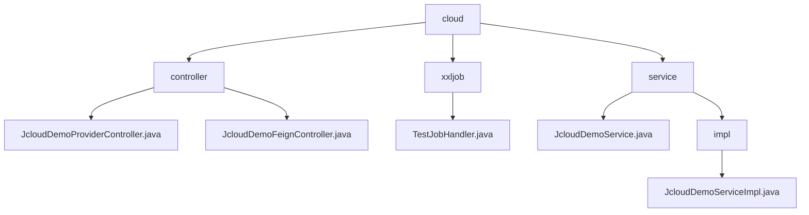

# 基础信息

|      |      |
|------|------|
| 名称 | cloud |
| 编码语言 | .java |
| 代码路径 | JeecgBoot/jeecg-boot/jeecg-module-demo/src/main/java/org/jeecg/modules/demo/cloud |
| 包名 | JeecgBoot.jeecg-boot.jeecg-module-demo.src.main.java.org.jeecg.modules.demo.cloud |
| 概述说明 | 该模块展示JeecgBoot框架下控制器与服务层交互，实现消息获取和个性化问候功能。 |

# 说明

## 概述
该代码模块是一个基于JeecgBoot框架的示例模块，展示了在微服务架构中控制器与服务层之间的交互方式。模块包含两个核心组件：控制器类（`JcloudDemoProviderController`和`JcloudDemoFeignController`）和服务类（`JcloudDemoService`及其实现类`JcloudDemoServiceImpl`）。控制器通过调用服务层接口获取数据并返回给调用方，体现了微服务架构中模块化设计和分层交互的特点。此外，模块还实现了一个简单的问候服务，通过传入的用户名称生成个性化的问候消息，展示了接口与实现分离的设计理念。

## 主要业务场景
1. **消息获取与返回**：`JcloudDemoProviderController`通过调用`/test/getMessage`接口，从`JcloudDemoService`中获取消息并返回给调用方。这一场景展示了控制器与服务层之间的简单交互，以及基本业务逻辑的实现。
2. **微服务架构示例**：该模块作为JeecgBoot框架中的示例模块，主要用于演示微服务架构中控制器与服务层之间的交互方式，为开发者提供参考和实现示例。
3. **生成个性化问候消息**：通过`JcloudDemoServiceImpl`类处理传入的用户名称，生成包含该名称的问候消息，提供个性化的用户体验。
4. **接口与实现分离**：通过`JcloudDemoService`接口定义服务功能，并由`JcloudDemoServiceImpl`类具体实现，确保代码的可扩展性和维护性。
5. **灵活响应**：系统能够根据不同的用户输入，动态生成相应的问候语，适用于需要个性化问候的各种应用场景。

### 包内部结构视图

该流程图展示了JeecgBoot项目中`cloud`模块的目录结构及其子文件和子文件夹的层级关系。`cloud`目录下包含`controller`、`xxljob`和`service`三个子目录，其中`controller`目录下有两个控制器文件，`xxljob`目录下有一个任务处理器文件，`service`目录下包含一个服务接口文件和一个`impl`子目录，`impl`子目录中有一个服务实现类文件。

# 文件列表 File List

| 名称   | 类型  | 说明 |
|-------|------|-------------|
| [controller](controller/_module.md) | package | JcloudDemoProviderController调用接口获取消息并返回，展示控制器与服务层交互。 |
| [service](service/_module.md) | package | JcloudDemoServiceImpl类实现JcloudDemoService接口，生成个性化问候消息。 |
| [xxljob](xxljob/_module.md) | package | 信息为空，无法生成概要描述。 |

