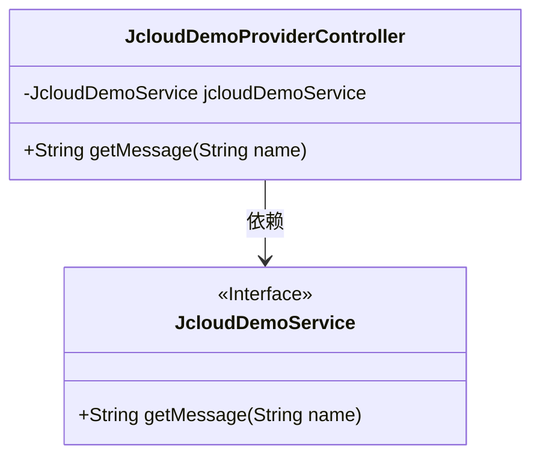
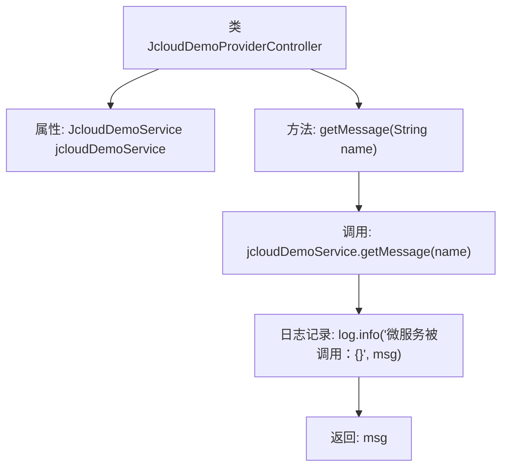

# 基础信息

|      |      |
|------|------|
| 名称 | JcloudDemoProviderController |
| 编码语言 | .java |
| 代码路径 | JeecgBoot/jeecg-boot/jeecg-module-demo/src/main/java/org/jeecg/modules/demo/cloud/controller/JcloudDemoProviderController.java |
| 包名 | org.jeecg.modules.demo.cloud.controller |
| 依赖项 | ['lombok.extern.slf4j.Slf4j', 'org.jeecg.common.api.vo.Result', 'org.jeecg.modules.demo.cloud.service.JcloudDemoService', 'org.springframework.web.bind.annotation.GetMapping', 'org.springframework.web.bind.annotation.RequestMapping', 'org.springframework.web.bind.annotation.RequestParam', 'org.springframework.web.bind.annotation.RestController', 'javax.annotation.Resource'] |
| 概述说明 | JcloudDemoProviderController通过/test/getMessage接口调用JcloudDemoService获取消息并返回。 |

# 说明

JcloudDemoProviderController通过调用/test/getMessage接口，利用JcloudDemoService获取消息，并将该消息返回给调用方。这一过程展示了控制器与服务层之间的交互，以及接口的简单功能实现。

# 类列表 Class Summary

| 名称   | 类型  | 说明 |
|-------|------|-------------|
| JcloudDemoProviderController | class | JcloudDemoProviderController通过/test/getMessage接口调用JcloudDemoService获取并返回消息。 |

## 类 JcloudDemoProviderController

|      |      |
|------|------|
| 访问范围 | @Slf4j;@RestController;@RequestMapping("/test");public |
| 类型 | class |
| 名称 | JcloudDemoProviderController |
| 说明 | JcloudDemoProviderController通过/test/getMessage接口调用JcloudDemoService获取并返回消息。 |

### UML类图

这段代码定义了一个名为 `JcloudDemoProviderController` 的控制器类，它通过 `@RestController` 和 `@RequestMapping` 注解将其映射到 `/test` 路径。该类依赖于 `JcloudDemoService` 接口，通过 `@Resource` 注解注入服务实例。`getMessage` 方法接收一个 `name` 参数，调用 `JcloudDemoService` 的 `getMessage` 方法获取消息，并记录日志后返回该消息。`JcloudDemoService` 是一个接口，定义了 `getMessage` 方法。

### 内部方法调用关系图

这段代码是一个Spring Boot的REST控制器类，用于处理HTTP GET请求。控制器类`JcloudDemoProviderController`通过`@GetMapping`注解映射到`/test/getMessage`路径，并接收一个名为`name`的请求参数。方法内部调用了`jcloudDemoService`的`getMessage`方法，获取消息后记录日志并返回该消息。流程图展示了类结构、方法调用以及日志记录和返回值的流程。

### 字段列表 Field List

| 名称  | 类型  | 说明 |
|-------|-------|------|
| jcloudDemoService | JcloudDemoService | 资源注入JcloudDemoService实例。 |

### 方法列表 Method List

| 名称  | 类型  | 说明 |
|-------|-------|------|
| getMessage | String | 通过GET请求获取消息，调用微服务并记录日志。 |

