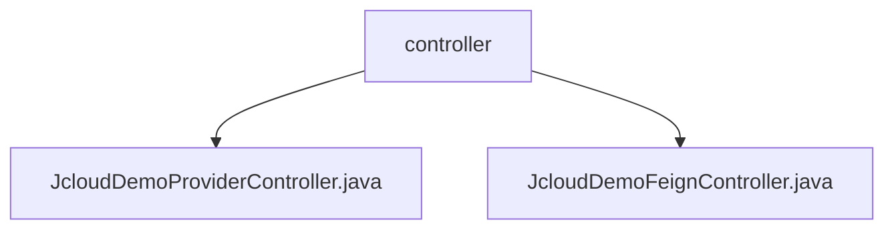

# 基础信息

|      |      |
|------|------|
| 名称 | controller |
| 编码语言 | .java |
| 代码路径 | JeecgBoot/jeecg-boot/jeecg-module-demo/src/main/java/org/jeecg/modules/demo/cloud/controller |
| 包名 | JeecgBoot.jeecg-boot.jeecg-module-demo.src.main.java.org.jeecg.modules.demo.cloud.controller |
| 概述说明 | JcloudDemoProviderController调用接口获取消息并返回，展示控制器与服务层交互。 |

# 说明

## 概述
该代码模块是一个基于JeecgBoot框架的示例模块，主要展示了在微服务架构中控制器与服务层之间的交互方式。模块中包含两个控制器类：`JcloudDemoProviderController`和`JcloudDemoFeignController`。其中，`JcloudDemoProviderController`通过调用`/test/getMessage`接口，利用`JcloudDemoService`获取消息，并将该消息返回给调用方。这一过程体现了控制器与服务层之间的简单交互，以及接口的基本功能实现。

## 主要业务场景
1. **消息获取与返回**：`JcloudDemoProviderController`通过调用`/test/getMessage`接口，从`JcloudDemoService`中获取消息，并将该消息返回给调用方。这一场景展示了控制器如何与服务层进行交互，并实现简单的业务逻辑。
2. **微服务架构示例**：该模块作为JeecgBoot框架中的示例模块，主要用于演示在微服务架构中控制器与服务层之间的交互方式，为开发者提供参考和实现示例。

### 包内部结构视图

该流程图展示了`controller`文件夹与其内部的两个Java文件之间的层级关系。`controller`文件夹包含`JcloudDemoProviderController.java`和`JcloudDemoFeignController.java`两个文件，这两个文件直接依赖于`controller`文件夹，没有其他子文件夹或文件。

# 文件列表 File List

| 名称   | 类型  | 说明 |
|-------|------|-------------|
| [JcloudDemoFeignController.java](JcloudDemoFeignController.md) | file | 信息为空，无法生成概要描述。 |
| [JcloudDemoProviderController.java](JcloudDemoProviderController.md) | file | JcloudDemoProviderController通过/test/getMessage接口调用JcloudDemoService获取消息并返回。 |

