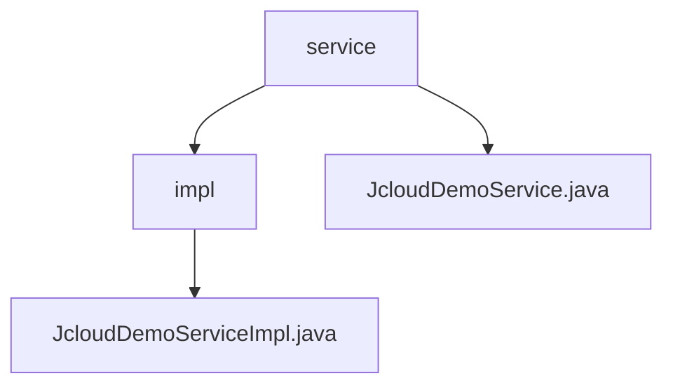

# 基础信息

|      |      |
|------|------|
| 名称 | service |
| 编码语言 | .java |
| 代码路径 | JeecgBoot/jeecg-boot/jeecg-module-demo/src/main/java/org/jeecg/modules/demo/cloud/service |
| 包名 | JeecgBoot.jeecg-boot.jeecg-module-demo.src.main.java.org.jeecg.modules.demo.cloud.service |
| 概述说明 | JcloudDemoServiceImpl类实现JcloudDemoService接口，生成个性化问候消息。 |

# 说明

## 概述
该代码模块的核心功能是实现一个简单的问候服务，通过`JcloudDemoService`接口和`JcloudDemoServiceImpl`类来实现。`JcloudDemoServiceImpl`类实现了`JcloudDemoService`接口，主要负责处理传入的名称参数，并生成相应的问候消息作为输出。这种设计使得系统能够灵活地响应用户输入，提供个性化的问候服务。

## 主要业务场景
该模块的主要业务场景包括：
1. **生成个性化问候消息**：通过传入的用户名称，生成包含该名称的问候消息，提供个性化的用户体验。
2. **接口与实现分离**：通过`JcloudDemoService`接口定义服务功能，并由`JcloudDemoServiceImpl`类具体实现，确保代码的可扩展性和维护性。
3. **灵活响应**：系统能够根据不同的用户输入，动态生成相应的问候语，适用于需要个性化问候的各种应用场景。

### 包内部结构视图

该流程图展示了JeecgBoot项目中`cloud`模块的服务层结构。`service`文件夹下包含`impl`子文件夹和`JcloudDemoService.java`文件，而`impl`文件夹中则包含`JcloudDemoServiceImpl.java`文件。这种结构清晰地反映了服务接口与实现类的层级关系，符合常见的Java项目组织方式。

# 文件列表 File List

| 名称   | 类型  | 说明 |
|-------|------|-------------|
| [JcloudDemoService.java](JcloudDemoService.md) | file | 无信息提供，无法生成描述。 |
| [impl](impl/_module.md) | package | JcloudDemoServiceImpl类实现接口，返回带名称的问候消息。 |

