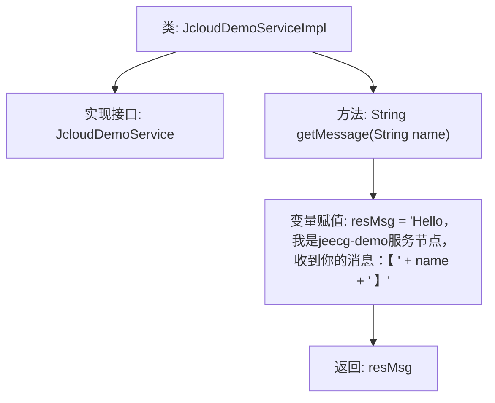

# 基础信息

|      |      |
|------|------|
| 名称 | JcloudDemoServiceImpl |
| 编码语言 | .java |
| 代码路径 | JeecgBoot/jeecg-boot/jeecg-module-demo/src/main/java/org/jeecg/modules/demo/cloud/service/impl/JcloudDemoServiceImpl.java |
| 包名 | org.jeecg.modules.demo.cloud.service.impl |
| 依赖项 | ['org.jeecg.common.api.vo.Result', 'org.jeecg.modules.demo.cloud.service.JcloudDemoService', 'org.springframework.stereotype.Service'] |
| 概述说明 | JcloudDemoServiceImpl类实现接口，返回带名称的问候消息。 |

# 说明

JcloudDemoServiceImpl类实现了JcloudDemoService接口，其主要功能是生成并返回一个包含输入名称的问候消息。通过实现该接口，该类能够处理传入的名称参数，并生成相应的问候语作为输出。这种设计使得系统能够灵活地响应用户输入，提供个性化的问候服务。

# 类列表 Class Summary

| 名称   | 类型  | 说明 |
|-------|------|-------------|
| JcloudDemoServiceImpl | class | JcloudDemoServiceImpl类实现JcloudDemoService接口，返回包含输入名称的问候消息。 |


## 类 JcloudDemoServiceImpl

|      |      |
|------|------|
| 访问范围 | @Service;public |
| 类型 | class |
| 名称 | JcloudDemoServiceImpl |
| 说明 | JcloudDemoServiceImpl类实现JcloudDemoService接口，返回包含输入名称的问候消息。 |


### UML类图

```mermaid
classDiagram
    class JcloudDemoServiceImpl {
        +String getMessage(String name)
    }
    <<Interface>> JcloudDemoService {
        +String getMessage(String name)
    }
    JcloudDemoServiceImpl --> JcloudDemoService : 实现
```

**描述：**  
`JcloudDemoServiceImpl` 类实现了 `JcloudDemoService` 接口，提供了 `getMessage` 方法的具体实现。该方法接收一个字符串参数 `name`，并返回一个包含该参数的自定义消息。类与接口之间的关系通过实现关系表示，`JcloudDemoServiceImpl` 依赖于 `JcloudDemoService` 接口。


### 内部方法调用关系图



这段代码描述了一个名为 `JcloudDemoServiceImpl` 的类，它实现了 `JcloudDemoService` 接口。类中包含一个 `getMessage` 方法，该方法接收一个字符串参数 `name`，并将其嵌入到一条固定的欢迎消息中，最后返回这条消息。流程图展示了类的结构以及方法内部的逻辑流程，从接收参数到生成并返回最终的消息。

### 字段列表 Field List

| 名称  | 类型  | 说明 |
|-------|-------|------|

### 方法列表 Method List

| 名称  | 类型  | 说明 |
|-------|-------|------|
| getMessage | String | 方法getMessage接收name参数，返回包含name的问候消息。 |


