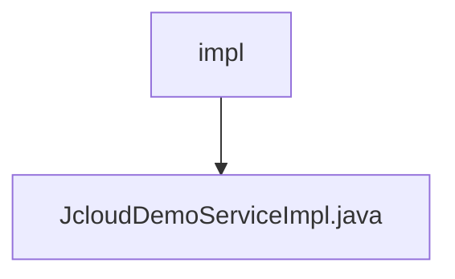

# 基础信息

|      |      |
|------|------|
| 名称 | impl |
| 编码语言 | .java |
| 代码路径 | JeecgBoot/jeecg-boot/jeecg-module-demo/src/main/java/org/jeecg/modules/demo/cloud/service/impl |
| 包名 | JeecgBoot.jeecg-boot.jeecg-module-demo.src.main.java.org.jeecg.modules.demo.cloud.service.impl |
| 概述说明 | JcloudDemoServiceImpl类实现接口，返回带名称的问候消息。 |

# 说明

JcloudDemoServiceImpl类实现了JcloudDemoService接口，其主要功能是生成并返回一个包含输入名称的问候消息。通过实现该接口，该类能够处理传入的名称参数，并生成相应的问候语作为输出。这种设计使得系统能够灵活地响应用户输入，提供个性化的问候服务。

### 包内部结构视图

该流程图展示了路径中的层级关系，`impl`文件夹作为父节点，包含一个子节点`JcloudDemoServiceImpl.java`，表示该文件位于`impl`文件夹下。路径结构简洁明了，符合给定的路径信息。

# 文件列表 File List

| 名称   | 类型  | 说明 |
|-------|------|-------------|
| [JcloudDemoServiceImpl.java](JcloudDemoServiceImpl.md) | file | JcloudDemoServiceImpl类实现接口，返回带名称的问候消息。 |

