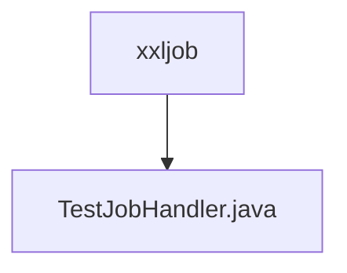

# 基础信息

|      |      |
|------|------|
| 名称 | xxljob |
| 编码语言 | .java |
| 代码路径 | JeecgBoot/jeecg-boot/jeecg-module-demo/src/main/java/org/jeecg/modules/demo/cloud/xxljob |
| 包名 | JeecgBoot.jeecg-boot.jeecg-module-demo.src.main.java.org.jeecg.modules.demo.cloud.xxljob |
| 概述说明 | 信息为空，无法生成概要描述。 |

# 说明

由于提供的输入内容为空，无法生成具体的总结描述。请提供相关的内容或信息，以便进行准确的总结和描述。

### 包内部结构视图

该流程图展示了路径的层级关系，其中`xxljob`文件夹包含了`TestJobHandler.java`文件。这种结构清晰地反映了文件在项目中的位置和所属关系，便于开发者快速定位和管理代码文件。

# 文件列表 File List

| 名称   | 类型  | 说明 |
|-------|------|-------------|
| [TestJobHandler.java](TestJobHandler.md) | file | 信息为空，无法生成概要描述。 |

