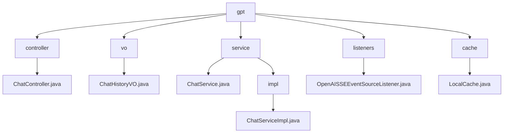

# 基础信息

|      |      |
|------|------|
| 名称 | gpt |
| 编码语言 | .java |
| 代码路径 | JeecgBoot/jeecg-boot/jeecg-module-demo/src/main/java/org/jeecg/modules/demo/gpt |
| 包名 | JeecgBoot.jeecg-boot.jeecg-module-demo.src.main.java.org.jeecg.modules.demo.gpt |
| 概述说明 | ChatController管理聊天功能，ChatHistoryVO存储聊天记录，ChatServiceImpl处理GPT交互，OpenAISSEEventSourceListener处理SSE事件，本地缓存优化性能。 |

# 说明

## 概述
该代码模块是一个基于JeecgBoot框架的聊天服务模块，主要功能是实现与GPT模型的交互。模块涵盖了聊天功能的各个方面，包括建立SSE连接以实现实时通信、处理用户发送的消息、保存和检索聊天记录、以及在会话结束时关闭连接。通过一系列类和服务，模块确保了聊天过程的高效性、数据完整性以及系统的稳定性和可靠性。

## 主要业务场景
1. **聊天记录的保存与管理**：在用户与GPT模型进行交互时，所有聊天记录会被保存到`ChatHistoryVO`类中，该类通过序列化功能确保数据可以在网络中传输或持久化存储，便于后续查询和分析。
2. **AI配置的检查**：在发送消息前，系统会验证AI配置的正确性，确保GPT模型能够正常工作，避免因配置错误导致的服务中断。
3. **消息的发送与接收**：通过`ChatController`和`OpenAISSEEventSourceListener`类，系统管理SSE连接，实时接收和解析GPT模型生成的消息，并将消息发送给用户。
4. **异常处理与系统稳定性**：在聊天过程中，系统会捕获并处理各种异常情况，确保聊天服务的稳定性和可靠性，避免因异常导致的服务中断或数据丢失。
5. **缓存管理**：模块设计了本地缓存机制，缓存时长和清理间隔均设置为5分钟。系统会自动启动定时清理任务，确保缓存数据在指定时间后自动清除，优化系统性能并避免缓存数据过期或占用过多资源。

通过这些功能，该模块为用户提供了一个高效、稳定且可靠的聊天服务，支持与GPT模型的实时交互，并确保数据的完整性和系统的稳定性。

### 包内部结构视图

该流程图展示了`gpt`模块下的层级结构，包括`controller`、`vo`、`service`、`listeners`和`cache`五个主要文件夹。每个文件夹下分别包含不同的文件，如`ChatController.java`、`ChatHistoryVO.java`、`ChatService.java`等，展示了模块内部的详细文件组织关系。

# 文件列表 File List

| 名称   | 类型  | 说明 |
|-------|------|-------------|
| [cache](cache/_module.md) | package | 本地缓存类，缓存时长和清理间隔均为5分钟，自动启动定时清理任务。 |
| [listeners](listeners/_module.md) | package | OpenAISSEEventSourceListener类负责SSE事件处理，管理消息、回调和错误。 |
| [service](service/_module.md) | package | ChatServiceImpl实现聊天服务，负责保存记录、检查配置、发送消息及异常处理，确保稳定可靠。 |
| [vo](vo/_module.md) | package | ChatHistoryVO类包含话题ID和聊天记录，支持序列化。 |
| [controller](controller/_module.md) | package | ChatController负责聊天功能，管理SSE连接、消息发送及记录操作。 |

