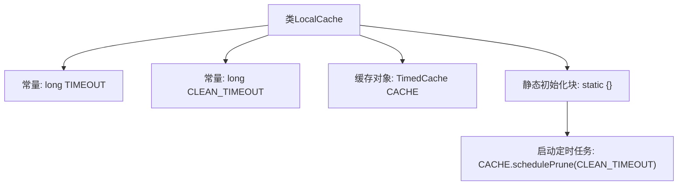

# 基础信息

|      |      |
|------|------|
| 名称 | LocalCache |
| 编码语言 | .java |
| 代码路径 | JeecgBoot/jeecg-boot/jeecg-module-demo/src/main/java/org/jeecg/modules/demo/gpt/cache/LocalCache.java |
| 包名 | org.jeecg.modules.demo.gpt.cache |
| 依赖项 | ['cn.hutool.cache.CacheUtil', 'cn.hutool.cache.impl.TimedCache', 'cn.hutool.core.date.DateUnit'] |
| 概述说明 | 本地缓存类，缓存时长和清理间隔均为5分钟，自动启动定时清理任务。 |

# 说明

本地缓存类设计了一个缓存机制，缓存时长和清理间隔均设置为5分钟。系统会自动启动定时清理任务，确保缓存数据在指定时间后自动清除，以维持缓存的有效性和及时性。这种设计有助于优化系统性能，避免缓存数据过期或占用过多资源。

# 类列表 Class Summary

| 名称   | 类型  | 说明 |
|-------|------|-------------|
| LocalCache | class | 本地缓存类，缓存时长和清理间隔均为5分钟，定时清理任务自动启动。 |


## 类 LocalCache

|      |      |
|------|------|
| 访问范围 | public |
| 类型 | class |
| 名称 | LocalCache |
| 说明 | 本地缓存类，缓存时长和清理间隔均为5分钟，定时清理任务自动启动。 |


### UML类图

```mermaid
classDiagram
    class LocalCache {
        <<static>>
        +long TIMEOUT
        -long CLEAN_TIMEOUT
        +TimedCache~String, Object~ CACHE
        +static {}
    }

    class TimedCache~K, V~ {
        <<Interface>>
        +void schedulePrune(long interval)
    }

    class CacheUtil {
        <<static>>
        +TimedCache~K, V~ newTimedCache(long timeout)
    }

    LocalCache --> TimedCache : 使用
    LocalCache --> CacheUtil : 依赖
```

类图描述：`LocalCache` 类包含静态常量 `TIMEOUT` 和 `CLEAN_TIMEOUT`，以及一个静态的 `TimedCache` 对象 `CACHE`。`LocalCache` 在静态初始化块中调用 `CACHE` 的 `schedulePrune` 方法，用于定时清理缓存。`TimedCache` 是一个泛型接口，提供了 `schedulePrune` 方法。`CacheUtil` 是一个工具类，提供了创建 `TimedCache` 实例的静态方法 `newTimedCache`。`LocalCache` 依赖于 `TimedCache` 和 `CacheUtil` 来实现缓存功能。


### 内部方法调用关系图



这段代码定义了一个名为`LocalCache`的类，其中包含两个常量`TIMEOUT`和`CLEAN_TIMEOUT`，分别表示缓存时长和清理间隔。类中还定义了一个静态的`TimedCache`对象`CACHE`，用于存储缓存数据。在静态初始化块中，通过调用`CACHE.schedulePrune(CLEAN_TIMEOUT)`方法启动了一个定时任务，定期清理过期的缓存数据。这段代码的主要作用是实现一个具有定时清理功能的本地缓存系统。

### 字段列表 Field List

| 名称  | 类型  | 说明 |
|-------|-------|------|
| TIMEOUT = 5 * DateUnit.MINUTE.getMillis() | long | 定义了5分钟超时的静态常量TIMEOUT。 |
| CACHE = CacheUtil.newTimedCache(TIMEOUT) | TimedCache<String, Object> | 创建具有超时功能的静态缓存对象CACHE。 |
| CLEAN_TIMEOUT = 5 * DateUnit.MINUTE.getMillis() | long | 定义了一个私有的静态常量CLEAN_TIMEOUT，值为5分钟对应的毫秒数。 |

### 方法列表 Method List

| 名称  | 类型  | 说明 |
|-------|-------|------|


