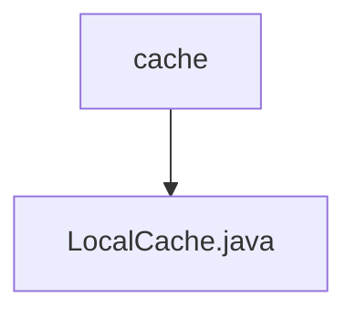

# 基础信息

|      |      |
|------|------|
| 名称 | cache |
| 编码语言 | .java |
| 代码路径 | JeecgBoot/jeecg-boot/jeecg-module-demo/src/main/java/org/jeecg/modules/demo/gpt/cache |
| 包名 | JeecgBoot.jeecg-boot.jeecg-module-demo.src.main.java.org.jeecg.modules.demo.gpt.cache |
| 概述说明 | 本地缓存类，缓存时长和清理间隔均为5分钟，自动启动定时清理任务。 |

# 说明

本地缓存类设计了一个缓存机制，缓存时长和清理间隔均设置为5分钟。系统会自动启动定时清理任务，确保缓存数据在指定时间后自动清除，以维持缓存的有效性和及时性。这种设计有助于优化系统性能，避免缓存数据过期或占用过多资源。

### 包内部结构视图

该流程图展示了`cache`文件夹与`LocalCache.java`文件之间的层级关系。`cache`是父节点，`LocalCache.java`是其子节点，表示`LocalCache.java`文件位于`cache`文件夹内。这种结构清晰地反映了文件在项目中的位置关系。

# 文件列表 File List

| 名称   | 类型  | 说明 |
|-------|------|-------------|
| [LocalCache.java](LocalCache.md) | file | 本地缓存类，缓存时长和清理间隔均为5分钟，自动启动定时清理任务。 |

