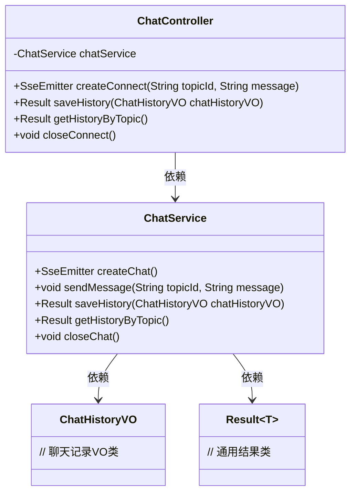
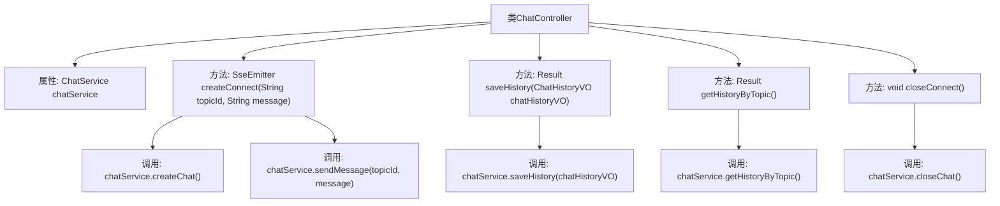

# 基础信息

|      |      |
|------|------|
| 名称 | ChatController |
| 编码语言 | .java |
| 代码路径 | JeecgBoot/jeecg-boot/jeecg-module-demo/src/main/java/org/jeecg/modules/demo/gpt/controller/ChatController.java |
| 包名 | org.jeecg.modules.demo.gpt.controller |
| 依赖项 | ['org.jeecg.common.api.vo.Result', 'org.jeecg.modules.demo.gpt.service.ChatService', 'org.jeecg.modules.demo.gpt.vo.ChatHistoryVO', 'org.springframework.beans.factory.annotation.Autowired', 'org.springframework.stereotype.Controller', 'org.springframework.web.bind.annotation', 'org.springframework.web.servlet.mvc.method.annotation.SseEmitter'] |
| 概述说明 | ChatController负责聊天功能，管理SSE连接、消息发送及记录操作。 |

# 说明

ChatController负责管理聊天功能的各个方面，包括建立SSE连接以实现实时通信，处理用户发送的消息，保存和检索聊天记录，以及在会话结束时关闭连接，确保聊天过程的高效性和数据完整性。

# 类列表 Class Summary

| 名称   | 类型  | 说明 |
|-------|------|-------------|
| ChatController | class | ChatController处理聊天功能，包括创建SSE连接、发送消息、保存和查询聊天记录及关闭连接。 |

## 类 ChatController

|      |      |
|------|------|
| 访问范围 | @Controller;@RequestMapping("/test/ai/chat");public |
| 类型 | class |
| 名称 | ChatController |
| 说明 | ChatController处理聊天功能，包括创建SSE连接、发送消息、保存和查询聊天记录及关闭连接。 |

### UML类图

这段代码描述了一个名为 `ChatController` 的控制器类，它通过 `ChatService` 处理与聊天相关的请求。`ChatController` 提供了创建SSE连接、发送消息、保存聊天记录、查询聊天记录以及关闭连接的功能。`ChatService` 是服务层，负责具体的业务逻辑处理，如创建聊天、发送消息、保存和查询聊天记录等。`ChatHistoryVO` 是聊天记录的值对象，`Result~T~` 是通用的结果类，用于封装返回结果。

### 内部方法调用关系图

该流程图展示了`ChatController`类的结构及其内部方法的调用关系。`ChatController`类通过`@Autowired`注入`ChatService`，并提供了四个主要方法：`createConnect`用于创建SSE连接并发送消息，`saveHistory`用于保存聊天记录，`getHistoryByTopic`用于查询聊天记录，`closeConnect`用于关闭连接。每个方法都调用了`ChatService`中的相应方法来完成具体操作。

### 字段列表 Field List

| 名称  | 类型  | 说明 |
|-------|-------|------|
| chatService | ChatService | 使用@Autowired注解自动注入ChatService实例。 |

### 方法列表 Method List

| 名称  | 类型  | 说明 |
|-------|-------|------|
| closeConnect | void | 通过GET请求关闭聊天连接。 |
| saveHistory | Result<?> | Post请求保存聊天历史，返回处理结果。 |
| getHistoryByTopic | Result<ChatHistoryVO> | 通过GET请求获取指定主题的聊天历史记录。 |
| createConnect | SseEmitter | 创建SSE连接并发送消息，返回SSE发射器。 |

