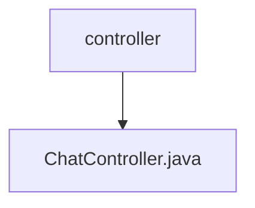

# 基础信息

|      |      |
|------|------|
| 名称 | controller |
| 编码语言 | .java |
| 代码路径 | JeecgBoot/jeecg-boot/jeecg-module-demo/src/main/java/org/jeecg/modules/demo/gpt/controller |
| 包名 | JeecgBoot.jeecg-boot.jeecg-module-demo.src.main.java.org.jeecg.modules.demo.gpt.controller |
| 概述说明 | ChatController负责聊天功能，管理SSE连接、消息发送及记录操作。 |

# 说明

ChatController负责管理聊天功能的各个方面，包括建立SSE连接以实现实时通信，处理用户发送的消息，保存和检索聊天记录，以及在会话结束时关闭连接，确保聊天过程的高效性和数据完整性。

### 包内部结构视图

该流程图展示了路径中的层级关系，`controller`文件夹下包含一个文件`ChatController.java`。路径结构简洁明了，清晰地反映了文件在文件夹中的位置。

# 文件列表 File List

| 名称   | 类型  | 说明 |
|-------|------|-------------|
| [ChatController.java](ChatController.md) | file | ChatController负责聊天功能，管理SSE连接、消息发送及记录操作。 |

