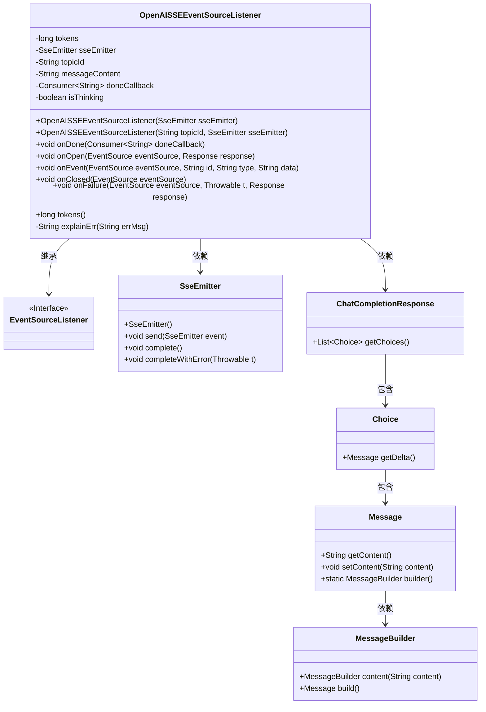

# 基础信息

|      |      |
|------|------|
| 名称 | OpenAISSEEventSourceListener |
| 编码语言 | .java |
| 代码路径 | JeecgBoot/jeecg-boot/jeecg-module-demo/src/main/java/org/jeecg/modules/demo/gpt/listeners/OpenAISSEEventSourceListener.java |
| 包名 | org.jeecg.modules.demo.gpt.listeners |
| 依赖项 | ['com.fasterxml.jackson.databind.ObjectMapper', 'com.unfbx.chatgpt.entity.chat.ChatCompletionResponse', 'com.unfbx.chatgpt.entity.chat.Message', 'lombok.SneakyThrows', 'lombok.extern.slf4j.Slf4j', 'okhttp3.Response', 'okhttp3.ResponseBody', 'okhttp3.sse.EventSource', 'okhttp3.sse.EventSourceListener', 'org.apache.commons.lang3.StringUtils', 'org.jetbrains.annotations.NotNull', 'org.springframework.web.servlet.mvc.method.annotation.SseEmitter', 'java.util.Objects', 'java.util.function.Consumer'] |
| 概述说明 | OpenAISSEEventSourceListener类负责SSE事件处理，管理消息、回调和错误。 |

# 说明

OpenAISSEEventSourceListener类负责处理SSE（Server-Sent Events）事件，主要功能包括管理消息内容的接收与解析、执行回调函数以响应事件，以及处理可能发生的错误。该类确保事件流的稳定性和可靠性，通过有效的错误处理机制保障系统的正常运行。

# 类列表 Class Summary

| 名称   | 类型  | 说明 |
|-------|------|-------------|
| OpenAISSEEventSourceListener | class | OpenAISSEEventSourceListener类处理SSE事件，管理消息内容、回调及错误处理。 |

## 类 OpenAISSEEventSourceListener

|      |      |
|------|------|
| 访问范围 | @Slf4j;public |
| 类型 | class |
| 名称 | OpenAISSEEventSourceListener |
| 说明 | OpenAISSEEventSourceListener类处理SSE事件，管理消息内容、回调及错误处理。 |

### UML类图

这段代码定义了一个`OpenAISSEEventSourceListener`类，该类继承自`EventSourceListener`接口，用于处理SSE（Server-Sent Events）事件。该类通过`SseEmitter`对象与前端进行通信，处理来自AI聊天模型的响应数据。代码中包含了多个回调方法，如`onOpen`、`onEvent`、`onClosed`和`onFailure`，用于处理不同的事件状态。`onEvent`方法负责解析返回的JSON数据，并根据内容发送给前端。`onFailure`方法处理连接异常，并发送错误信息。整个类通过`tokens`计数器记录处理的消息数量，并通过`doneCallback`回调函数通知消息完成。

### 内部方法调用关系图

```mermaid
graph TD
    A["类OpenAISSEEventSourceListener"]
    B["属性: long tokens"]
    C["属性: SseEmitter sseEmitter"]
    D["属性: String topicId"]
    E["属性: String messageContent"]
    F["属性: Consumer<String> doneCallback"]
    G["属性: boolean isThinking"]
    H["构造方法: OpenAISSEEventSourceListener(SseEmitter sseEmitter)"]
    I["构造方法: OpenAISSEEventSourceListener(String topicId, SseEmitter sseEmitter)"]
    J["方法: onDone(Consumer<String> doneCallback)"]
    K["重写方法: onOpen(EventSource eventSource, Response response)"]
    L["重写方法: onEvent(EventSource eventSource, String id, String type, String data)"]
    M["重写方法: onClosed(EventSource eventSource)"]
    N["重写方法: onFailure(EventSource eventSource, Throwable t, Response response)"]
    O["方法: explainErr(String errMsg)"]
    P["方法: tokens()"]

    A --> B
    A --> C
    A --> D
    A --> E
    A --> F
    A --> G
    A --> H
    A --> I
    A --> J
    A --> K
    A --> L
    A --> M
    A --> N
    A --> O
    A --> P
```

这段代码定义了一个 `OpenAISSEEventSourceListener` 类，用于处理 SSE（Server-Sent Events）连接的事件监听。该类包含多个属性和方法，用于管理 SSE 连接、处理事件、记录消息内容以及在连接关闭或失败时执行相应的操作。代码的主要功能是通过 SSE 连接接收和处理 AI 聊天返回的数据，并在特定事件触发时执行回调函数或发送响应给前端。

### 字段列表 Field List

| 名称  | 类型  | 说明 |
|-------|-------|------|
| tokens | long | 定义了一个长整型私有变量tokens。 |
| messageContent = "" | String | 定义私有字符串变量messageContent并初始化为空。 |
| sseEmitter | SseEmitter | 定义了一个私有的SseEmitter对象。 |
| doneCallback | Consumer<String> | 私有成员变量doneCallback，类型为Consumer<String>。 |
| topicId | String | 定义了一个私有字符串变量topicId。 |
| isThinking = false | boolean | 私有布尔变量isThinking初始值为false。 |

### 方法列表 Method List

| 名称  | 类型  | 说明 |
|-------|-------|------|
| onOpen | void | AI聊天建立SSE连接日志记录。 |
| tokens | long | 该方法返回长整型变量tokens的值。 |
| onClosed | void | 流式输出结束，记录tokens数并关闭SSE连接。 |
| explainErr | String | 根据错误信息返回相应提示，包含频率限制处理。 |
| onDone | void | 定义方法onDone，接受Consumer<String>参数并赋值给doneCallback。 |
| onFailure | void | SSE连接异常处理：记录错误、发送错误信息并重连。 |
| onEvent | void | 处理AI聊天事件，记录数据并发送给前端，支持think标签，异常时关闭连接。 |

