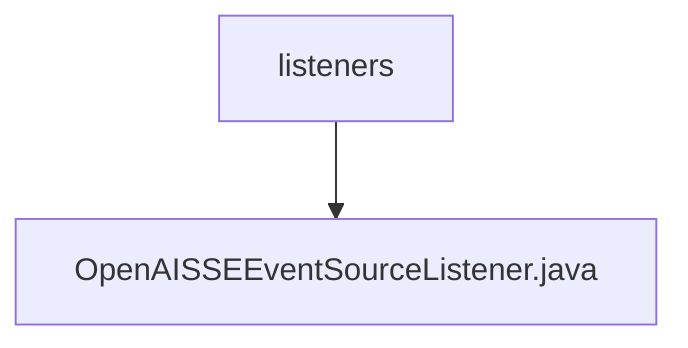

# 基础信息

|      |      |
|------|------|
| 名称 | listeners |
| 编码语言 | .java |
| 代码路径 | JeecgBoot/jeecg-boot/jeecg-module-demo/src/main/java/org/jeecg/modules/demo/gpt/listeners |
| 包名 | JeecgBoot.jeecg-boot.jeecg-module-demo.src.main.java.org.jeecg.modules.demo.gpt.listeners |
| 概述说明 | OpenAISSEEventSourceListener类负责SSE事件处理，管理消息、回调和错误。 |

# 说明

OpenAISSEEventSourceListener类负责处理SSE（Server-Sent Events）事件，主要功能包括管理消息内容的接收与解析、执行回调函数以响应事件，以及处理可能发生的错误。该类确保事件流的稳定性和可靠性，通过有效的错误处理机制保障系统的正常运行。

### 包内部结构视图

该流程图展示了路径 `JeecgBoot/jeecg-boot/jeecg-module-demo/src/main/java/org/jeecg/modules/demo/gpt/listeners` 及其子文件 `OpenAISSEEventSourceListener.java` 的层级关系。`listeners` 是父节点，`OpenAISSEEventSourceListener.java` 是其唯一的子节点，表示该路径下仅包含一个文件。

# 文件列表 File List

| 名称   | 类型  | 说明 |
|-------|------|-------------|
| [OpenAISSEEventSourceListener.java](OpenAISSEEventSourceListener.md) | file | OpenAISSEEventSourceListener类负责SSE事件处理，管理消息、回调和错误。 |

