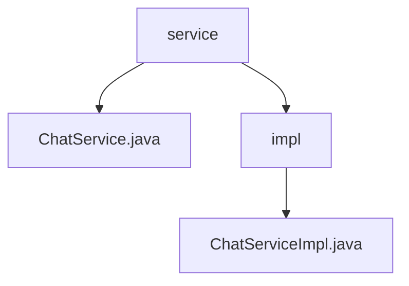

# 基础信息

|      |      |
|------|------|
| 名称 | service |
| 编码语言 | .java |
| 代码路径 | JeecgBoot/jeecg-boot/jeecg-module-demo/src/main/java/org/jeecg/modules/demo/gpt/service |
| 包名 | JeecgBoot.jeecg-boot.jeecg-module-demo.src.main.java.org.jeecg.modules.demo.gpt.service |
| 概述说明 | ChatServiceImpl实现聊天服务，负责保存记录、检查配置、发送消息及异常处理，确保稳定可靠。 |

# 说明

## 概述
该代码模块是一个基于JeecgBoot框架的聊天服务模块，主要功能是实现与GPT模型的交互，包括聊天记录的保存、AI配置的检查、消息的发送以及异常处理。该模块的核心类`ChatServiceImpl`负责确保聊天数据能够被有效存储，并在发送消息前验证AI配置的正确性，同时具备处理各种异常情况的能力，以保障聊天过程的稳定性和可靠性。

## 主要业务场景
1. **聊天记录的保存**：在用户与GPT模型进行交互时，所有聊天记录会被保存，以便后续查询和分析。
2. **AI配置的检查**：在发送消息前，系统会验证AI配置的正确性，确保GPT模型能够正常工作。
3. **消息的发送**：通过GPT模型生成回复消息，并将消息发送给用户。
4. **异常处理**：在聊天过程中，系统会捕获并处理各种异常情况，确保聊天服务的稳定性和可靠性。

### 包内部结构视图

该流程图展示了 `service` 文件夹与其子文件夹 `impl` 以及文件 `ChatService.java` 和 `ChatServiceImpl.java` 之间的层级关系。`service` 文件夹包含一个直接文件和 `impl` 子文件夹，而 `impl` 子文件夹中又包含 `ChatServiceImpl.java` 文件。

# 文件列表 File List

| 名称   | 类型  | 说明 |
|-------|------|-------------|
| [ChatService.java](ChatService.md) | file | 信息为空，无法生成概要描述。 |
| [impl](impl/_module.md) | package | ChatServiceImpl实现聊天服务，支持记录保存、AI检查、消息发送及异常处理。 |

