# 基础信息

|      |      |
|------|------|
| 名称 | ChatServiceImpl |
| 编码语言 | .java |
| 代码路径 | JeecgBoot/jeecg-boot/jeecg-module-demo/src/main/java/org/jeecg/modules/demo/gpt/service/impl/ChatServiceImpl.java |
| 包名 | org.jeecg.modules.demo.gpt.service.impl |
| 依赖项 | ['cn.hutool.core.util.StrUtil', 'cn.hutool.json.JSONUtil', 'com.alibaba.fastjson.JSONArray', 'com.unfbx.chatgpt.OpenAiStreamClient', 'com.unfbx.chatgpt.entity.chat.ChatCompletion', 'com.unfbx.chatgpt.entity.chat.Message', 'com.unfbx.chatgpt.exception.BaseException', 'lombok.extern.slf4j.Slf4j', 'org.apache.shiro.SecurityUtils', 'org.jeecg.chatgpt.prop.AiChatProperties', 'org.jeecg.common.api.vo.Result', 'org.jeecg.common.exception.JeecgBootException', 'org.jeecg.common.system.vo.LoginUser', 'org.jeecg.common.util.SpringContextUtils', 'org.jeecg.common.util.UUIDGenerator', 'org.jeecg.modules.demo.gpt.cache.LocalCache', 'org.jeecg.modules.demo.gpt.listeners.OpenAISSEEventSourceListener', 'org.jeecg.modules.demo.gpt.service.ChatService', 'org.jeecg.modules.demo.gpt.vo.ChatHistoryVO', 'org.springframework.beans.factory.annotation.Autowired', 'org.springframework.data.redis.core.RedisTemplate', 'org.springframework.stereotype.Service', 'org.springframework.web.servlet.mvc.method.annotation.SseEmitter', 'java.io.IOException', 'java.util.ArrayList', 'java.util.List'] |
| 概述说明 | ChatServiceImpl实现聊天服务，支持记录保存、AI检查、消息发送及异常处理。 |

# 说明

ChatServiceImpl是一个实现聊天服务的类，主要功能包括聊天记录的保存、AI配置的检查、消息的发送以及异常处理。该服务确保聊天数据能够被有效存储，并在发送消息前验证AI配置的正确性，同时具备处理各种异常情况的能力，以保障聊天过程的稳定性和可靠性。

# 类列表 Class Summary

| 名称   | 类型  | 说明 |
|-------|------|-------------|
| ChatServiceImpl | class | ChatServiceImpl实现聊天服务，支持聊天记录保存、AI配置检查、消息发送及异常处理。 |

## 类 ChatServiceImpl

|      |      |
|------|------|
| 访问范围 | @Service;@Slf4j;public |
| 类型 | class |
| 名称 | ChatServiceImpl |
| 说明 | ChatServiceImpl实现聊天服务，支持聊天记录保存、AI配置检查、消息发送及异常处理。 |

### UML类图

```mermaid
classDiagram
    class ChatServiceImpl {
        -String CACHE_KEY_PREFIX
        -String CACHE_KEY_MSG_CONTEXT
        -String CACHE_KEY_MSG_HISTORY
        -RedisTemplate redisTemplate
        -OpenAiStreamClient openAiStreamClient
        -AiChatProperties aiChatProperties
        +void ensureClient()
        +String getUserId()
        +SseEmitter createChat()
        +void closeChat()
        +void sendMessage(String topicId, String message)
        +Result<?> saveHistory(ChatHistoryVO chatHistoryVO)
        +Result<ChatHistoryVO> getHistoryByTopic()
        -void sendErrorMsg(String msg)
    }
    class ChatService {
        <<Interface>>
        +SseEmitter createChat()
        +void closeChat()
        +void sendMessage(String topicId, String message)
        +Result<?> saveHistory(ChatHistoryVO chatHistoryVO)
        +Result<ChatHistoryVO> getHistoryByTopic()
    }
    class RedisTemplate {
        +void opsForHash().put(String key, String field, Object value)
        +Object opsForHash().get(String key, String field)
        +void opsForValue().set(String key, Object value)
        +Object opsForValue().get(String key)
    }
    class OpenAiStreamClient {
        +void streamChatCompletion(ChatCompletion completion, OpenAISSEEventSourceListener listener)
    }
    class AiChatProperties {
        +String getModel()
    }
    class ChatHistoryVO {
        +String getContent()
        +void setContent(String content)
    }
    class SseEmitter {
        +void onCompletion(Runnable callback)
        +void onTimeout(Runnable callback)
        +void onError(Consumer<Throwable> callback)
        +void send(SseEmitter.Event event)
        +void complete()
    }
    class Message {
        +String getContent()
        +void setContent(String content)
        +Message.Role getRole()
        +void setRole(Message.Role role)
    }
    class ChatCompletion {
        +List<Message> getMessages()
        +void setMessages(List<Message> messages)
        +String getModel()
        +void setModel(String model)
    }
    class OpenAISSEEventSourceListener {
        +void onDone(Consumer<String> callback)
    }
    class LocalCache {
        +Map<String, Object> CACHE
    }
    ChatServiceImpl --> ChatService : 实现
    ChatServiceImpl --> RedisTemplate : 依赖
    ChatServiceImpl --> OpenAiStreamClient : 依赖
    ChatServiceImpl --> AiChatProperties : 依赖
    ChatServiceImpl --> SseEmitter : 依赖
    ChatServiceImpl --> LocalCache : 依赖
    ChatServiceImpl --> Message : 依赖
    ChatServiceImpl --> ChatCompletion : 依赖
    ChatServiceImpl --> OpenAISSEEventSourceListener : 依赖
    ChatServiceImpl --> ChatHistoryVO : 依赖
```

这段代码定义了一个 `ChatServiceImpl` 类，实现了 `ChatService` 接口，用于处理聊天相关的业务逻辑。它依赖 `RedisTemplate` 进行缓存操作，`OpenAiStreamClient` 进行流式聊天交互，`AiChatProperties` 获取 AI 聊天配置，`SseEmitter` 用于服务器推送事件，`LocalCache` 用于本地缓存管理，`Message` 和 `ChatCompletion` 用于构建聊天消息和完成请求，`OpenAISSEEventSourceListener` 用于监听聊天事件，`ChatHistoryVO` 用于处理聊天历史记录。代码通过多个方法实现了聊天连接的创建、关闭、消息发送、历史记录保存和获取等功能。

### 内部方法调用关系图

```mermaid
graph TD
    A["类ChatServiceImpl"]
    B["属性: String CACHE_KEY_PREFIX"]
    C["属性: String CACHE_KEY_MSG_CONTEXT"]
    D["属性: String CACHE_KEY_MSG_HISTORY"]
    E["属性: RedisTemplate redisTemplate"]
    F["属性: OpenAiStreamClient openAiStreamClient"]
    G["属性: AiChatProperties aiChatProperties"]
    H["方法: ensureClient()"]
    I["方法: String getUserId()"]
    J["方法: SseEmitter createChat()"]
    K["方法: void closeChat()"]
    L["方法: void sendMessage(String topicId, String message)"]
    M["方法: Result<?> saveHistory(ChatHistoryVO chatHistoryVO)"]
    N["方法: Result<ChatHistoryVO> getHistoryByTopic()"]
    O["方法: void sendErrorMsg(String msg)"]

    A --> B
    A --> C
    A --> D
    A --> E
    A --> F
    A --> G
    A --> H
    A --> I
    A --> J
    A --> K
    A --> L
    A --> M
    A --> N
    A --> O
```

这段代码是一个实现了 `ChatService` 接口的 `ChatServiceImpl` 类，主要用于处理聊天相关的业务逻辑。类中包含多个属性，如缓存键前缀、Redis模板、OpenAI流客户端等。类中的方法包括创建聊天连接、关闭聊天连接、发送消息、保存聊天记录、获取聊天记录等。`ensureClient` 方法用于确保 `OpenAiStreamClient` 和 `AiChatProperties` 被正确注入。`sendErrorMsg` 方法用于在发生异常时向前端发送错误信息。整体代码结构清晰，功能模块划分明确，适合处理复杂的聊天业务场景。

### 字段列表 Field List

| 名称  | 类型  | 说明 |
|-------|-------|------|
| redisTemplate | RedisTemplate | 使用@Autowired自动注入RedisTemplate实例。 |
| CACHE_KEY_PREFIX = "ai:chart:" | String | 定义静态常量CACHE_KEY_PREFIX，值为"ai:chart:"。 |
| openAiStreamClient = null | OpenAiStreamClient | 私有变量openAiStreamClient初始化为空。 |
| aiChatProperties | AiChatProperties | 定义私有变量aiChatProperties，类型为AiChatProperties。 |
| CACHE_KEY_MSG_HISTORY = "msg_history" | String | 定义常量CACHE_KEY_MSG_HISTORY，值为"msg_history"。 |
| CACHE_KEY_MSG_CONTEXT = "msg_content" | String | 定义静态常量CACHE_KEY_MSG_CONTENT，值为"msg_content"。 |

### 方法列表 Method List

| 名称  | 类型  | 说明 |
|-------|-------|------|
| getUserId | String | 该方法通过安全工具获取当前登录用户ID。 |
| saveHistory | Result<?> | 保存用户聊天记录至Redis缓存，返回成功结果。 |
| getHistoryByTopic | Result<ChatHistoryVO> | 通过用户ID从Redis获取聊天历史并返回结果。 |
| ensureClient | void | 未配置AI助手时提示用户设置相应配置。 |
| createChat | SseEmitter | 创建SSE连接，处理完成、超时、异常回调，并管理缓存。 |
| closeChat | void | 关闭聊天时，获取用户ID并完成SSE连接，同时从缓存中移除该用户。 |
| sendMessage | void | 方法发送消息，检查参数，生成话题ID，保存聊天记录，推送消息，处理AI响应。 |
| sendErrorMsg | void | 发送错误消息并完成SSE事件，包含错误信息和完成标识，设置重连时间。 |

