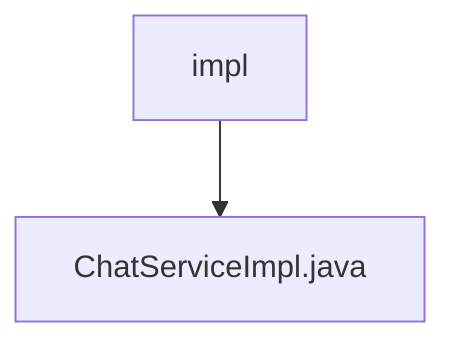

# 基础信息

|      |      |
|------|------|
| 名称 | impl |
| 编码语言 | .java |
| 代码路径 | JeecgBoot/jeecg-boot/jeecg-module-demo/src/main/java/org/jeecg/modules/demo/gpt/service/impl |
| 包名 | JeecgBoot.jeecg-boot.jeecg-module-demo.src.main.java.org.jeecg.modules.demo.gpt.service.impl |
| 概述说明 | ChatServiceImpl实现聊天服务，支持记录保存、AI检查、消息发送及异常处理。 |

# 说明

ChatServiceImpl是一个实现聊天服务的类，主要功能包括聊天记录的保存、AI配置的检查、消息的发送以及异常处理。该服务确保聊天数据能够被有效存储，并在发送消息前验证AI配置的正确性，同时具备处理各种异常情况的能力，以保障聊天过程的稳定性和可靠性。

### 包内部结构视图

该流程图展示了路径的层级关系，其中`impl`是父节点，`ChatServiceImpl.java`是其子节点。这表示`ChatServiceImpl.java`文件位于`impl`目录下，体现了文件与目录之间的从属关系。

# 文件列表 File List

| 名称   | 类型  | 说明 |
|-------|------|-------------|
| [ChatServiceImpl.java](ChatServiceImpl.md) | file | ChatServiceImpl实现聊天服务，支持记录保存、AI检查、消息发送及异常处理。 |

