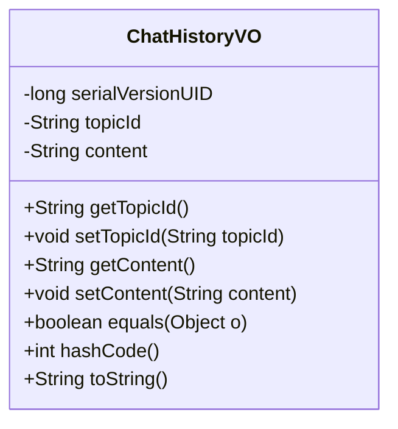
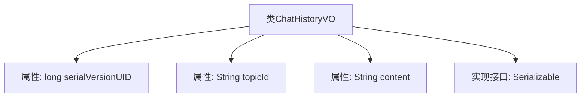

# 基础信息

|      |      |
|------|------|
| 名称 | ChatHistoryVO |
| 编码语言 | .java |
| 代码路径 | JeecgBoot/jeecg-boot/jeecg-module-demo/src/main/java/org/jeecg/modules/demo/gpt/vo/ChatHistoryVO.java |
| 包名 | org.jeecg.modules.demo.gpt.vo |
| 依赖项 | ['lombok.Data', 'java.io.Serializable'] |
| 概述说明 | ChatHistoryVO类包含话题ID和聊天记录，支持序列化。 |

# 说明

ChatHistoryVO类是一个用于存储和管理聊天记录的数据结构，主要包含两个关键属性：话题ID和聊天记录内容。该类实现了序列化功能，确保其对象可以被转换为字节流，便于在网络中传输或持久化存储。通过这种方式，ChatHistoryVO类能够有效地组织和处理与特定话题相关的聊天信息。

# 类列表 Class Summary

| 名称   | 类型  | 说明 |
|-------|------|-------------|
| ChatHistoryVO | class | ChatHistoryVO类包含话题ID和聊天记录内容，实现序列化。 |

## 类 ChatHistoryVO

|      |      |
|------|------|
| 访问范围 | @Data;public |
| 类型 | class |
| 名称 | ChatHistoryVO |
| 说明 | ChatHistoryVO类包含话题ID和聊天记录内容，实现序列化。 |

### UML类图

**描述**：  
`ChatHistoryVO` 类是一个用于表示聊天历史记录的值对象，实现了 `Serializable` 接口以确保其可序列化。类中包含两个主要属性：`topicId` 用于标识聊天话题的唯一ID，`content` 用于存储聊天记录的内容。类还提供了标准的 getter 和 setter 方法，以及 `equals`、`hashCode` 和 `toString` 方法，用于对象的比较、哈希计算和字符串表示。

### 内部方法调用关系图

该流程图描述了`ChatHistoryVO`类的基本结构。类包含三个属性：`serialVersionUID`、`topicId`和`content`，并且实现了`Serializable`接口。`serialVersionUID`用于序列化版本控制，`topicId`存储话题的唯一标识，`content`存储聊天记录的内容。该类主要用于序列化和反序列化聊天历史数据。

### 字段列表 Field List

| 名称  | 类型  | 说明 |
|-------|-------|------|
| serialVersionUID = 3238429500037511283L | long | 定义了一个静态长整型常量serialVersionUID。 |
| content | String | 内容涉及字符串变量定义与使用。 |
| topicId | String | 主题ID变量声明。 |

### 方法列表 Method List

| 名称  | 类型  | 说明 |
|-------|-------|------|

