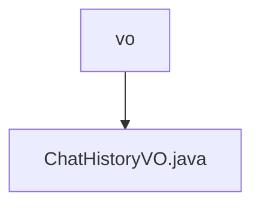

# 基础信息

|      |      |
|------|------|
| 名称 | vo |
| 编码语言 | .java |
| 代码路径 | JeecgBoot/jeecg-boot/jeecg-module-demo/src/main/java/org/jeecg/modules/demo/gpt/vo |
| 包名 | JeecgBoot.jeecg-boot.jeecg-module-demo.src.main.java.org.jeecg.modules.demo.gpt.vo |
| 概述说明 | ChatHistoryVO类包含话题ID和聊天记录，支持序列化。 |

# 说明

ChatHistoryVO类是一个用于存储和管理聊天记录的数据结构，主要包含两个关键属性：话题ID和聊天记录内容。该类实现了序列化功能，确保其对象可以被转换为字节流，便于在网络中传输或持久化存储。通过这种方式，ChatHistoryVO类能够有效地组织和处理与特定话题相关的聊天信息。

### 包内部结构视图

该流程图展示了路径中的层级关系，`vo` 是文件夹，`ChatHistoryVO.java` 是该文件夹下的文件。路径结构简单，仅包含一个文件夹和一个文件，清晰地反映了文件在目录中的位置。

# 文件列表 File List

| 名称   | 类型  | 说明 |
|-------|------|-------------|
| [ChatHistoryVO.java](ChatHistoryVO.md) | file | ChatHistoryVO类包含话题ID和聊天记录，支持序列化。 |

