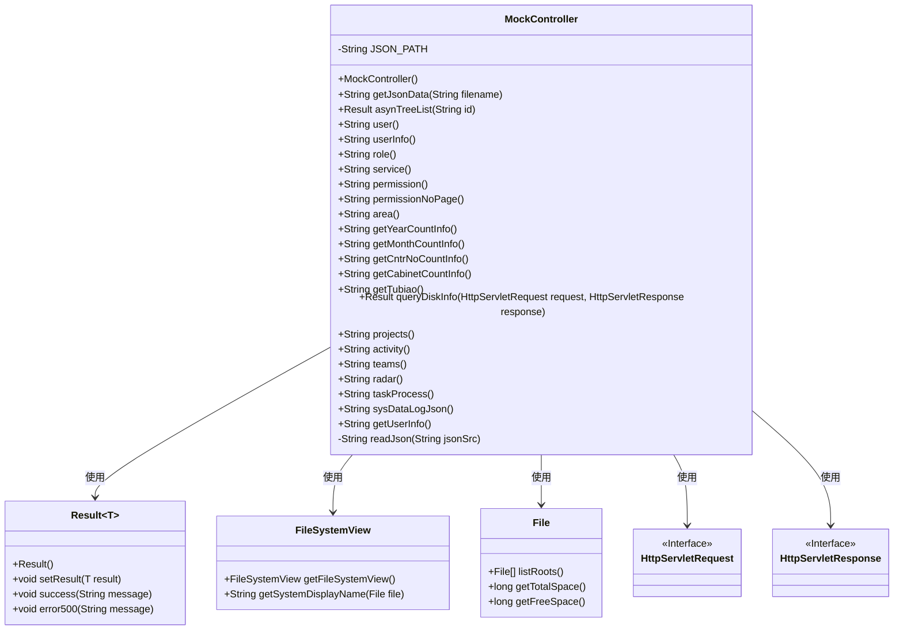

# 基础信息

|      |      |
|------|------|
| 名称 | MockController |
| 编码语言 | .java |
| 代码路径 | JeecgBoot/jeecg-boot/jeecg-module-demo/src/main/java/org/jeecg/modules/demo/mock/MockController.java |
| 包名 | org.jeecg.modules.demo.mock |
| 依赖项 | ['com.alibaba.fastjson.JSON', 'lombok.extern.slf4j.Slf4j', 'org.apache.commons.io.IOUtils', 'org.jeecg.common.api.vo.Result', 'org.springframework.web.bind.annotation', 'javax.servlet.http.HttpServletRequest', 'javax.servlet.http.HttpServletResponse', 'javax.swing.filechooser.FileSystemView', 'java.io.File', 'java.io.IOException', 'java.io.InputStream', 'java.util.ArrayList', 'java.util.HashMap', 'java.util.List', 'java.util.Map'] |
| 概述说明 | MockController提供多个接口读取JSON文件，涵盖用户、角色、权限等数据。 |

# 说明

MockController提供了多个接口，用于读取不同种类的JSON文件数据。这些接口涵盖了用户信息、角色信息、权限信息、省市县数据、报表数据、磁盘信息以及工作台数据等。通过这些接口，用户可以方便地获取和处理各类结构化数据，满足多种应用场景的需求。

# 类列表 Class Summary

| 名称   | 类型  | 说明 |
|-------|------|-------------|
| MockController | class | MockController提供多个接口读取JSON文件，包括用户、角色、权限、省市县、报表数据、磁盘信息和工作台数据等。 |

## 类 MockController

|      |      |
|------|------|
| 访问范围 | @RestController;@RequestMapping("/mock/api");@Slf4j;public |
| 类型 | class |
| 名称 | MockController |
| 说明 | MockController提供多个接口读取JSON文件，包括用户、角色、权限、省市县、报表数据、磁盘信息和工作台数据等。 |

### UML类图

这段代码定义了一个`MockController`类，它是一个Spring Boot的REST控制器，用于处理各种HTTP请求并返回JSON格式的响应。控制器通过`readJson`方法从类路径中读取JSON文件并返回其内容。`MockController`类依赖于`Result`类来处理返回结果，`FileSystemView`和`File`类用于查询磁盘信息，`HttpServletRequest`和`HttpServletResponse`接口用于处理HTTP请求和响应。该控制器提供了多个接口，用于获取用户信息、角色、权限、服务、省市县数据、报表数据以及工作台首页的数据等。

### 内部方法调用关系图

```mermaid
graph TD
    A["类MockController"]
    B["属性: String JSON_PATH"]
    C["方法: getJsonData(String filename)"]
    D["方法: asynTreeList(String id)"]
    E["方法: user()"]
    F["方法: userInfo()"]
    G["方法: role()"]
    H["方法: service()"]
    I["方法: permission()"]
    J["方法: permissionNoPage()"]
    K["方法: area()"]
    L["方法: getYearCountInfo()"]
    M["方法: getMonthCountInfo()"]
    N["方法: getCntrNoCountInfo()"]
    O["方法: getCabinetCountInfo()"]
    P["方法: getTubiao()"]
    Q["方法: queryDiskInfo(HttpServletRequest request, HttpServletResponse response)"]
    R["方法: projects()"]
    S["方法: activity()"]
    T["方法: teams()"]
    U["方法: radar()"]
    V["方法: taskProcess()"]
    W["方法: sysDataLogJson()"]
    X["方法: getUserInfo()"]
    Y["方法: readJson(String jsonSrc)"]

    A --> B
    A --> C
    A --> D
    A --> E
    A --> F
    A --> G
    A --> H
    A --> I
    A --> J
    A --> K
    A --> L
    A --> M
    A --> N
    A --> O
    A --> P
    A --> Q
    A --> R
    A --> S
    A --> T
    A --> U
    A --> V
    A --> W
    A --> X
    A --> Y

    C --> Y
    D --> Y
    E --> Y
    F --> Y
    G --> Y
    H --> Y
    I --> Y
    J --> Y
    K --> Y
    L --> Y
    M --> Y
    N --> Y
    O --> Y
    P --> Y
    R --> Y
    S --> Y
    T --> Y
    U --> Y
    V --> Y
    W --> Y
    X --> Y
```

这段代码是一个Spring Boot的控制器类，主要用于处理HTTP请求并返回JSON数据。控制器类`MockController`包含多个GET请求处理方法，每个方法都通过调用`readJson`方法来读取指定路径的JSON文件并返回其内容。`readJson`方法负责从类路径中读取JSON文件并将其转换为字符串。这个类的主要作用是提供一系列模拟数据的接口，方便前端开发人员在开发过程中获取静态数据。

### 字段列表 Field List

| 名称  | 类型  | 说明 |
|-------|-------|------|
| JSON_PATH = "classpath:org/jeecg/modules/demo/mock/json" | String | 私有常量JSON_PATH指向类路径下的指定JSON文件目录。 |

### 方法列表 Method List

| 名称  | 类型  | 说明 |
|-------|-------|------|
| getJsonData | String | 通过GET请求获取指定文件名的JSON数据。 |
| projects | String | 获取项目列表并返回JSON数据。 |
| role | String | 使用GetMapping注解获取角色信息并返回JSON数据。 |
| getUserInfo | String | 通过GET请求获取用户信息，返回指定JSON文件内容。 |
| asynTreeList | Result | 通过GET请求获取异步树列表数据，返回JSON格式结果。 |
| getYearCountInfo | String | 该方法通过GET请求获取年度计数信息，返回指定JSON文件内容。 |
| userInfo | String | 通过GET请求获取用户信息，返回指定JSON文件内容。 |
| getCntrNoCountInfo | String | GET请求获取集装箱数量信息，返回JSON数据。 |
| service | String | GetMapping注解映射/service路径，返回指定JSON文件内容。 |
| permissionNoPage | String | 获取权限无分页数据，返回JSON文件内容。 |
| user | String | GetMapping注解定义/user路径，返回user.json文件内容。 |
| taskProcess | String | 定义GET请求处理路径/task/process，返回task_process.json文件内容。 |
| teams | String | 通过GET请求获取团队信息，返回指定JSON文件内容。 |
| permission | String | 该代码定义了一个GET请求接口，返回指定路径下的JSON文件内容。 |
| radar | String | 通过GET请求获取工作场所雷达数据，返回指定JSON文件内容。 |
| getCabinetCountInfo | String | 通过GET请求获取柜子数量信息，返回指定JSON文件内容。 |
| getMonthCountInfo | String | GET请求获取月度计数信息，返回指定JSON文件内容。 |
| activity | String | GET请求映射到/workplace/activity，返回指定JSON文件内容。 |
| queryDiskInfo | Result<List<Map<String,Object>>> | 查询磁盘信息，返回磁盘名称、总空间、剩余空间及剩余百分比。 |
| area | String | GET请求处理/area路径，返回指定JSON文件内容。 |
| readJson | String | 该方法读取JSON文件并返回其内容，解决SpringBoot读取JAR包中文件的问题。 |
| getTubiao | String | 该方法通过GET请求获取图表数据，返回指定JSON文件内容。 |
| sysDataLogJson | String | 该方法读取并返回指定路径的JSON文件内容。 |

