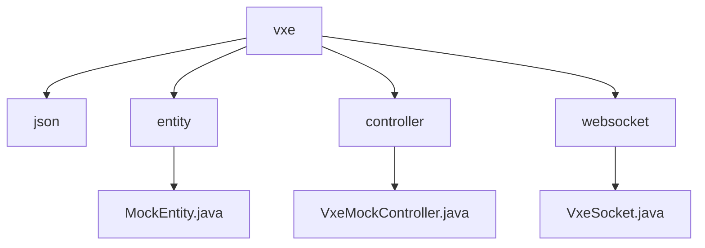

# 基础信息

|      |      |
|------|------|
| 名称 | vxe |
| 编码语言 | .java |
| 代码路径 | JeecgBoot/jeecg-boot/jeecg-module-demo/src/main/java/org/jeecg/modules/demo/mock/vxe |
| 包名 | JeecgBoot.jeecg-boot.jeecg-module-demo.src.main.java.org.jeecg.modules.demo.mock.vxe |
| 概述说明 | MockEntity类含id、parentId、status字段；VxeMockController支持实时数据更新；VxeSocket管理WebSocket通信。 |

# 说明

## 概述

该代码模块主要围绕模拟数据管理和实时通信功能展开，包含三个核心组件：`MockEntity`、`VxeMockController` 和 `VxeSocket`。`MockEntity` 是一个简单的实体类，用于表示具有层级关系和状态信息的实体。`VxeMockController` 是一个模拟数据操作工具，支持状态管理、拖轮控制和进度条显示等功能，并通过 Socket 实现数据的实时更新。`VxeSocket` 则负责管理 WebSocket 连接，支持多页面通信和事件处理。该模块适用于需要实时数据交互、模拟操作和多页面通信的业务场景。

## 主要业务场景

1. **层级关系与状态管理**  
   - 使用 `MockEntity` 类表示具有层级关系（通过 `parentId` 字段）和状态信息（通过 `status` 字段）的实体，适用于需要管理复杂实体关系的场景。

2. **实时数据模拟与操作**  
   - 通过 `VxeMockController` 实现模拟数据的更改和查询，支持状态管理、拖轮控制和进度条显示等功能，适用于需要实时数据交互和模拟操作的场景。

3. **多页面通信与事件处理**  
   - 使用 `VxeSocket` 类管理 WebSocket 连接，支持多页面之间的消息传递和事件处理，适用于需要高效通信和事件管理的多页面应用场景。

该模块通过结合实体管理、数据模拟和实时通信功能，提升了数据处理的效率和准确性，适用于需要复杂实体关系、实时数据交互和多页面通信的业务需求。

### 包内部结构视图

该流程图展示了`vxe`目录下的层级结构，包含`json`、`entity`、`controller`和`websocket`四个子目录。其中，`entity`目录下包含`MockEntity.java`文件，`controller`目录下包含`VxeMockController.java`文件，`websocket`目录下包含`VxeSocket.java`文件。该结构清晰地反映了代码的组织方式，便于理解和维护。

# 文件列表 File List

| 名称   | 类型  | 说明 |
|-------|------|-------------|
| [websocket](websocket/_module.md) | package | VxeSocket类管理WebSocket连接，支持多页面通信，提供消息发送和事件处理。 |
| [controller](controller/_module.md) | package | VxeMockController支持模拟数据操作，包括状态、拖轮、进度条，通过Socket实时更新。 |
| [entity](entity/_module.md) | package | MockEntity类有id、parentId和status三个字段。 |
| [json](json/_module.md) | package | None |

