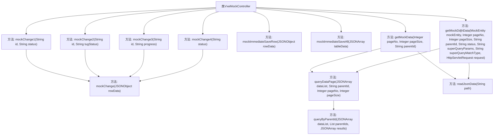

# 基础信息

|      |      |
|------|------|
| 名称 | VxeMockController |
| 编码语言 | .java |
| 代码路径 | JeecgBoot/jeecg-boot/jeecg-module-demo/src/main/java/org/jeecg/modules/demo/mock/vxe/controller/VxeMockController.java |
| 包名 | org.jeecg.modules.demo.mock.vxe.controller |
| 依赖项 | ['com.alibaba.fastjson.JSON', 'com.alibaba.fastjson.JSONArray', 'com.alibaba.fastjson.JSONObject', 'com.baomidou.mybatisplus.core.conditions.query.QueryWrapper', 'com.baomidou.mybatisplus.core.metadata.IPage', 'com.baomidou.mybatisplus.extension.plugins.pagination.Page', 'lombok.extern.slf4j.Slf4j', 'org.apache.commons.io.IOUtils', 'org.apache.commons.lang3.StringUtils', 'org.jeecg.common.api.vo.Result', 'org.jeecg.common.constant.VxeSocketConst', 'org.jeecg.common.system.query.MatchTypeEnum', 'org.jeecg.common.system.query.QueryCondition', 'org.jeecg.common.system.query.QueryGenerator', 'org.jeecg.modules.demo.mock.vxe.entity.MockEntity', 'org.jeecg.modules.demo.mock.vxe.websocket.VxeSocket', 'org.springframework.web.bind.annotation', 'javax.servlet.http.HttpServletRequest', 'java.io.IOException', 'java.io.InputStream', 'java.net.URLDecoder', 'java.util'] |
| 概述说明 | VxeMockController支持模拟数据操作，包括状态、拖轮、进度条，通过Socket实时更新。 |

# 说明

VxeMockController是一个用于模拟数据更改和查询的工具，支持多种操作如状态管理、拖轮控制和进度条显示。该工具通过Socket实现数据的实时更新，确保用户能够即时获取最新的数据状态。其功能全面，适用于需要实时数据交互和模拟操作的场景，提升了数据处理的效率和准确性。

# 类列表 Class Summary

| 名称   | 类型  | 说明 |
|-------|------|-------------|
| VxeMockController | class | VxeMockController模拟数据更改和查询，支持状态、拖轮、进度条等操作，通过Socket实时更新数据。 |

## 类 VxeMockController

|      |      |
|------|------|
| 访问范围 | @RestController;@RequestMapping("/mock/vxe");@Slf4j;public |
| 类型 | class |
| 名称 | VxeMockController |
| 说明 | VxeMockController模拟数据更改和查询，支持状态、拖轮、进度条等操作，通过Socket实时更新数据。 |

### UML类图

```mermaid
classDiagram
    class VxeMockController {
        -JSONObject mockChange(JSONObject rowData)
        +Result mockChange1(String id, String status)
        +Result mockChange2(String id, String tugStatus)
        +Result mockChange3(String id, String progress)
        +Result mockChange4(String status)
        +Result mockImmediateSaveRow(JSONObject rowData)
        +Result mockImmediateSaveAll(JSONArray tableData)
        +Result getMockData(Integer pageNo, Integer pageSize, String parentId)
        +Result getMockDdjhData(MockEntity mockEntity, Integer pageNo, Integer pageSize, String parentId, String status, String superQueryParams, String superQueryMatchType, HttpServletRequest request)
        -IPage~JSONObject~ queryDataPage(JSONArray dataList, String parentId, Integer pageNo, Integer pageSize)
        -void queryByParentId(JSONArray dataList, List~String~ parentIds, JSONArray results)
        -JSONArray readJsonData(String path)
    }

    class MockEntity {
        // MockEntity的属性和方法
    }

    class QueryWrapper~T~ {
        // QueryWrapper的属性和方法
    }

    class QueryGenerator {
        +QueryWrapper~T~ initQueryWrapper(T entity, Map~String, String[]~ parameterMap)
    }

    class MatchTypeEnum {
        // MatchTypeEnum的属性和方法
    }

    class QueryCondition {
        // QueryCondition的属性和方法
    }

    class Result {
        // Result的属性和方法
    }

    class JSONObject {
        // JSONObject的属性和方法
    }

    class JSONArray {
        // JSONArray的属性和方法
    }

    class VxeSocket {
        +String packageMessage(String type, JSONObject data)
        +void sendMessageToAll(String message)
    }

    class VxeSocketConst {
        <<Interface>>
        // VxeSocketConst的常量
    }

    VxeMockController --> MockEntity : 使用
    VxeMockController --> QueryWrapper~MockEntity~ : 使用
    VxeMockController --> QueryGenerator : 使用
    VxeMockController --> MatchTypeEnum : 使用
    VxeMockController --> QueryCondition : 使用
    VxeMockController --> Result : 返回
    VxeMockController --> JSONObject : 使用
    VxeMockController --> JSONArray : 使用
    VxeMockController --> VxeSocket : 使用
    VxeMockController --> VxeSocketConst : 使用
```

### 描述
`VxeMockController` 是一个用于模拟数据操作的控制器类，主要处理HTTP请求并返回相应的结果。它包含多个方法，用于模拟更改状态、拖轮状态、进度条状态等操作，并且支持即时保存单行数据和整个表格数据。此外，它还提供了获取模拟数据的功能，支持分页和高级查询。该类依赖于`MockEntity`、`QueryWrapper`、`QueryGenerator`、`MatchTypeEnum`、`QueryCondition`、`Result`、`JSONObject`、`JSONArray`、`VxeSocket`和`VxeSocketConst`等类来完成其功能。

### 内部方法调用关系图

这段代码展示了一个名为 `VxeMockController` 的控制器类，它包含了多个用于模拟数据操作的API方法。每个方法通过HTTP请求接收参数，并调用内部方法处理数据。`mockChange1`、`mockChange2`、`mockChange3` 和 `mockChange4` 方法分别用于模拟更改不同类型的状态，并最终调用 `mockChange` 方法封装数据并通过 `VxeSocket.sendMessageToAll` 发送消息。`getMockData` 和 `getMockDdjhData` 方法用于获取模拟数据，并支持分页和高级查询。内部方法 `queryDataPage` 和 `queryByParentId` 用于处理数据查询和分页逻辑，`readJsonData` 方法用于读取JSON文件数据。

### 字段列表 Field List

| 名称  | 类型  | 说明 |
|-------|-------|------|

### 方法列表 Method List

| 名称  | 类型  | 说明 |
|-------|-------|------|
| readJsonData | JSONArray | 私有方法读取指定路径的JSON数据并返回数组。 |
| mockChange1 | Result | 通过rowId和status模拟更改数据并发送消息。 |
| mockChange2 | Result | 已弃用接口mockChange2，通过id和tug_status参数模拟更改行数据并返回成功。 |
| mockImmediateSaveAll | Result | 即时保存接口，接收JSON数组，仅处理新增数据，避免重复更新。 |
| mockChange3 | Result | 通过ID和进度更新行数据并发送消息。 |
| queryByParentId | void | 递归查询父ID匹配的子数据并合并到结果集。 |
| getMockData | Result | GET请求获取分页数据，支持父级ID查询，读取JSON文件并返回结果。 |
| mockChange | void | mockChange方法封装socket数据并发送消息给所有在线用户。 |
| mockImmediateSaveRow | Result | Java方法mockImmediateSaveRow即时保存行数据，模拟网络延迟1.5秒。 |
| mockChange4 | Result | 通过GET请求模拟状态变更，封装并发送Socket消息给所有在线用户。 |
| queryDataPage | IPage<JSONObject> | 根据父级ID查询子级数据并分页返回，移除子节点信息。 |
| getMockDdjhData | Result | 接口获取模拟数据，支持分页、父级ID、状态及高级查询，处理拖轮状态计算并返回结果。 |

