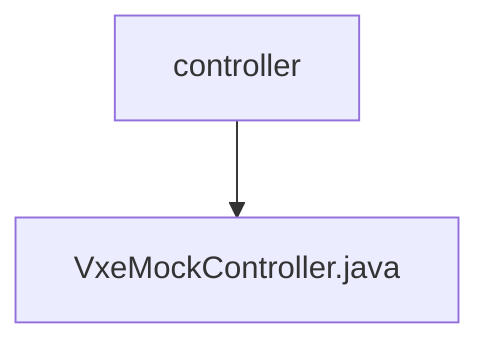

# 基础信息

|      |      |
|------|------|
| 名称 | controller |
| 编码语言 | .java |
| 代码路径 | JeecgBoot/jeecg-boot/jeecg-module-demo/src/main/java/org/jeecg/modules/demo/mock/vxe/controller |
| 包名 | JeecgBoot.jeecg-boot.jeecg-module-demo.src.main.java.org.jeecg.modules.demo.mock.vxe.controller |
| 概述说明 | VxeMockController支持模拟数据操作，包括状态、拖轮、进度条，通过Socket实时更新。 |

# 说明

VxeMockController是一个用于模拟数据更改和查询的工具，支持多种操作如状态管理、拖轮控制和进度条显示。该工具通过Socket实现数据的实时更新，确保用户能够即时获取最新的数据状态。其功能全面，适用于需要实时数据交互和模拟操作的场景，提升了数据处理的效率和准确性。

### 包内部结构视图

该流程图展示了路径的层级关系，`controller`文件夹包含一个名为`VxeMockController.java`的文件。路径结构简洁明了，反映了文件在项目中的具体位置和所属关系。

# 文件列表 File List

| 名称   | 类型  | 说明 |
|-------|------|-------------|
| [VxeMockController.java](VxeMockController.md) | file | VxeMockController支持模拟数据操作，包括状态、拖轮、进度条，通过Socket实时更新。 |

