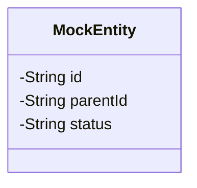
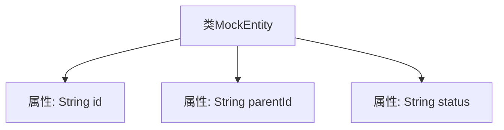

# 基础信息

|      |      |
|------|------|
| 名称 | MockEntity |
| 编码语言 | .java |
| 代码路径 | JeecgBoot/jeecg-boot/jeecg-module-demo/src/main/java/org/jeecg/modules/demo/mock/vxe/entity/MockEntity.java |
| 包名 | org.jeecg.modules.demo.mock.vxe.entity |
| 依赖项 | ['lombok.Data'] |
| 概述说明 | MockEntity类有id、parentId和status三个字段。 |

# 说明

MockEntity类是一个简单的实体类，包含三个关键字段：id、parentId和status。id字段用于唯一标识该实体，parentId字段表示该实体的父级实体标识，status字段则用于描述该实体的当前状态。这些字段共同构成了MockEntity类的基本结构，适用于需要表示具有层级关系和状态信息的实体场景。

# 类列表 Class Summary

| 名称   | 类型  | 说明 |
|-------|------|-------------|
| MockEntity | class | MockEntity类包含id、parentId和status三个字段。 |

## 类 MockEntity

|      |      |
|------|------|
| 访问范围 | @Data;public |
| 类型 | class |
| 名称 | MockEntity |
| 说明 | MockEntity类包含id、parentId和status三个字段。 |

### UML类图

这段代码定义了一个名为 `MockEntity` 的类，该类包含三个私有字段：`id`、`parentId` 和 `status`。这些字段分别用于存储实体的唯一标识、父级标识和状态信息。类图清晰地展示了这些字段的访问权限和类型，帮助开发者快速理解类的结构和用途。

### 内部方法调用关系图

这段代码定义了一个名为`MockEntity`的类，该类包含三个私有属性：`id`、`parentId`和`status`。这些属性分别用于存储实体的唯一标识、父级标识和状态信息。代码使用了Lombok的`@Data`注解，自动生成getter、setter、toString等方法，简化了代码的编写。通过流程图可以清晰地看到类与属性之间的层级关系，便于理解类的结构。

### 字段列表 Field List

| 名称  | 类型  | 说明 |
|-------|-------|------|
| parentId | String | 定义私有字符串变量parentId。 |
| id | String | 定义了一个私有字符串类型的变量id。 |
| status | String | 声明了一个私有的字符串变量status。 |

### 方法列表 Method List

| 名称  | 类型  | 说明 |
|-------|-------|------|

