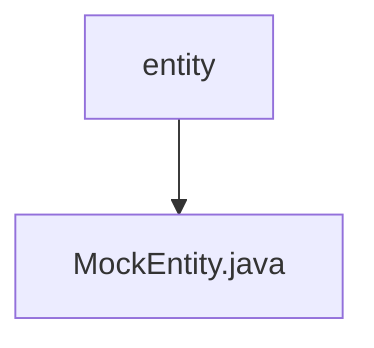

# 基础信息

|      |      |
|------|------|
| 名称 | entity |
| 编码语言 | .java |
| 代码路径 | JeecgBoot/jeecg-boot/jeecg-module-demo/src/main/java/org/jeecg/modules/demo/mock/vxe/entity |
| 包名 | JeecgBoot.jeecg-boot.jeecg-module-demo.src.main.java.org.jeecg.modules.demo.mock.vxe.entity |
| 概述说明 | MockEntity类有id、parentId和status三个字段。 |

# 说明

MockEntity类是一个简单的实体类，包含三个关键字段：id、parentId和status。id字段用于唯一标识该实体，parentId字段表示该实体的父级实体标识，status字段则用于描述该实体的当前状态。这些字段共同构成了MockEntity类的基本结构，适用于需要表示具有层级关系和状态信息的实体场景。

### 包内部结构视图

该流程图展示了路径层级关系，`entity` 是顶层目录，包含一个文件 `MockEntity.java`。图中清晰地反映了文件在目录中的位置，符合给定的路径信息。

# 文件列表 File List

| 名称   | 类型  | 说明 |
|-------|------|-------------|
| [MockEntity.java](MockEntity.md) | file | MockEntity类有id、parentId和status三个字段。 |

