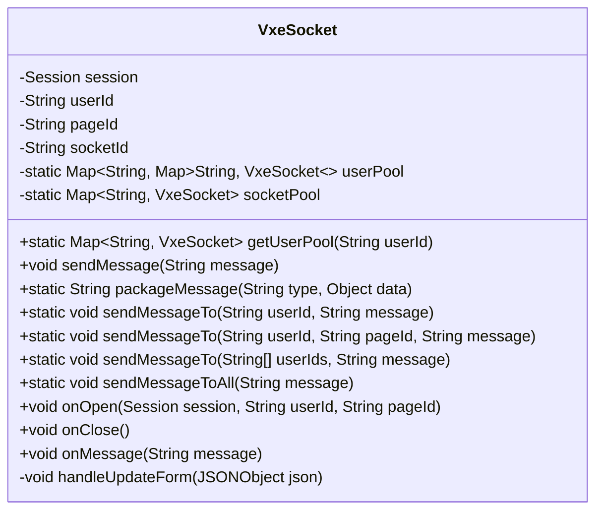
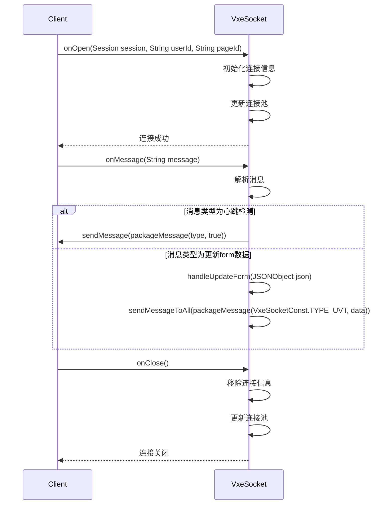

# 基础信息

|      |      |
|------|------|
| 名称 | VxeSocket |
| 编码语言 | .java |
| 代码路径 | JeecgBoot/jeecg-boot/jeecg-module-demo/src/main/java/org/jeecg/modules/demo/mock/vxe/websocket/VxeSocket.java |
| 包名 | org.jeecg.modules.demo.mock.vxe.websocket |
| 依赖项 | ['com.alibaba.fastjson.JSON', 'com.alibaba.fastjson.JSONObject', 'lombok.extern.slf4j.Slf4j', 'org.jeecg.common.constant.VxeSocketConst', 'org.springframework.stereotype.Component', 'javax.websocket.OnClose', 'javax.websocket.OnMessage', 'javax.websocket.OnOpen', 'javax.websocket.Session', 'javax.websocket.server.PathParam', 'javax.websocket.server.ServerEndpoint', 'java.util.Collection', 'java.util.HashMap', 'java.util.Map'] |
| 概述说明 | VxeSocket类管理WebSocket连接，支持多页面通信，提供消息发送和事件处理。 |

# 说明

VxeSocket类负责管理WebSocket连接，支持用户在多页面之间进行通信。该类提供了消息发送功能，允许用户在不同页面之间传递信息。同时，VxeSocket类还具备事件处理能力，能够响应和处理WebSocket连接中的各种事件，确保通信的稳定性和可靠性。通过该类，用户可以实现高效的多页面通信和事件管理。

# 类列表 Class Summary

| 名称   | 类型  | 说明 |
|-------|------|-------------|
| VxeSocket | class | VxeSocket类管理WebSocket连接，支持用户多页面通信，提供消息发送和事件处理功能。 |

## 类 VxeSocket

|      |      |
|------|------|
| 访问范围 | @Slf4j;@Component;@ServerEndpoint("/vxeSocket/{userId}/{pageId}");public |
| 类型 | class |
| 名称 | VxeSocket |
| 说明 | VxeSocket类管理WebSocket连接，支持用户多页面通信，提供消息发送和事件处理功能。 |

### UML类图

类图描述：`VxeSocket` 类是一个WebSocket服务端点，用于管理与用户的WebSocket连接。它包含多个私有成员变量，如`session`、`userId`、`pageId`和`socketId`，以及两个静态的`Map`对象`userPool`和`socketPool`，用于存储用户和连接的池。类中提供了多种方法，包括获取用户池、发送消息、处理消息等。`onOpen`、`onClose`和`onMessage`方法分别用于处理WebSocket的连接、断开和消息接收事件。

### 内部方法调用关系图

```mermaid
graph TD
    A["类VxeSocket"]
    B["属性: Session session"]
    C["属性: String userId"]
    D["属性: String pageId"]
    E["属性: String socketId"]
    F["静态属性: Map<String, Map<String, VxeSocket>> userPool"]
    G["静态属性: Map<String, VxeSocket> socketPool"]
    H["静态方法: getUserPool(String userId)"]
    I["方法: sendMessage(String message)"]
    J["静态方法: packageMessage(String type, Object data)"]
    K["静态方法: sendMessageTo(String userId, String message)"]
    L["静态方法: sendMessageTo(String userId, String pageId, String message)"]
    M["静态方法: sendMessageTo(String[] userIds, String message)"]
    N["静态方法: sendMessageToAll(String message)"]
    O["方法: onOpen(Session session, String userId, String pageId)"]
    P["方法: onClose()"]
    Q["方法: onMessage(String message)"]
    R["方法: handleUpdateForm(JSONObject json)"]

    A --> B
    A --> C
    A --> D
    A --> E
    A --> F
    A --> G
    A --> H
    A --> I
    A --> J
    A --> K
    A --> L
    A --> M
    A --> N
    A --> O
    A --> P
    A --> Q
    Q --> R
```

这段代码实现了一个基于WebSocket的通信类`VxeSocket`，用于管理用户连接、发送消息和处理消息。`VxeSocket`类通过`onOpen`、`onMessage`和`onClose`方法处理WebSocket的连接、消息接收和断开事件。`sendMessage`和`sendMessageTo`等方法用于向指定用户或所有用户发送消息。`handleUpdateForm`方法处理特定类型的消息并将其广播给所有用户。

### 字段列表 Field List

| 名称  | 类型  | 说明 |
|-------|-------|------|
| session | Session | 声明一个私有的Session对象变量。 |
| socketId | String | 定义私有字符串变量socketId。 |
| userId | String | 定义了一个私有字符串变量userId。 |
| pageId | String | 定义了一个私有字符串变量pageId。 |
| socketPool = new HashMap<>() | Map<String, VxeSocket> | 私有静态Map存储字符串与VxeSocket的映射关系。 |
| userPool = new HashMap<>() | Map<String, Map<String, VxeSocket>> | 定义静态哈希映射存储用户连接池。 |

### 方法列表 Method List

| 名称  | 类型  | 说明 |
|-------|-------|------|
| sendMessageToAll | void | 静态方法发送消息给所有连接的Socket对象。 |
| getUserPool | Map<String, VxeSocket> | 静态方法获取用户池，若不存在则新建HashMap。 |
| sendMessageTo | void | 静态方法发送消息给指定用户，若用户在线则发送，否则记录警告。 |
| onClose | void | 关闭连接时移除socket和用户池记录，并记录断开信息。 |
| sendMessageTo | void | 静态方法sendMessageTo向多个用户发送消息，循环调用VxeSocket.sendMessageTo。 |
| sendMessageTo | void | 通过用户ID和页面ID发送消息，若用户在线则发送，否则记录警告日志。 |
| sendMessage | void | 发送消息方法，异步发送文本，捕获异常并记录错误日志。 |
| handleUpdateForm | void | 处理更新表单，将事件数据转发给所有用户。 |
| onMessage | void | 处理Socket消息，解析JSON并处理心跳检测和表单更新。 |
| packageMessage | String | 该方法将类型和数据打包为JSON字符串并返回。 |
| onOpen | void | 方法onOpen处理新连接，存储用户和页面ID，更新连接池并记录日志。 |

