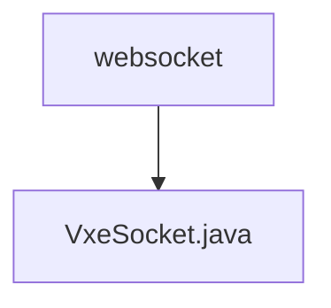

# 基础信息

|      |      |
|------|------|
| 名称 | websocket |
| 编码语言 | .java |
| 代码路径 | JeecgBoot/jeecg-boot/jeecg-module-demo/src/main/java/org/jeecg/modules/demo/mock/vxe/websocket |
| 包名 | JeecgBoot.jeecg-boot.jeecg-module-demo.src.main.java.org.jeecg.modules.demo.mock.vxe.websocket |
| 概述说明 | VxeSocket类管理WebSocket连接，支持多页面通信，提供消息发送和事件处理。 |

# 说明

VxeSocket类负责管理WebSocket连接，支持用户在多页面之间进行通信。该类提供了消息发送功能，允许用户在不同页面之间传递信息。同时，VxeSocket类还具备事件处理能力，能够响应和处理WebSocket连接中的各种事件，确保通信的稳定性和可靠性。通过该类，用户可以实现高效的多页面通信和事件管理。

### 包内部结构视图

该流程图展示了路径的层级关系，`websocket` 是顶级文件夹，`VxeSocket.java` 是其下的文件。路径结构简洁明了，反映了文件在项目中的具体位置。

# 文件列表 File List

| 名称   | 类型  | 说明 |
|-------|------|-------------|
| [VxeSocket.java](VxeSocket.md) | file | VxeSocket类管理WebSocket连接，支持多页面通信，提供消息发送和事件处理。 |

