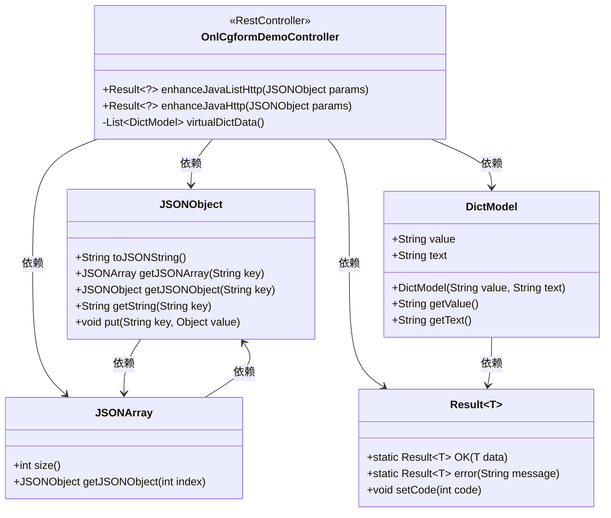
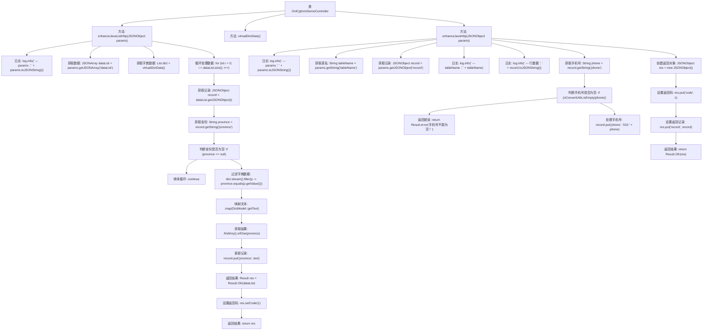

# 基础信息

|      |      |
|------|------|
| 名称 | OnlCgformDemoController |
| 编码语言 | .java |
| 代码路径 | JeecgBoot/jeecg-boot/jeecg-module-demo/src/main/java/org/jeecg/modules/demo/online/OnlCgformDemoController.java |
| 包名 | org.jeecg.modules.demo.online |
| 依赖项 | ['com.alibaba.fastjson.JSONArray', 'com.alibaba.fastjson.JSONObject', 'lombok.extern.slf4j.Slf4j', 'org.jeecg.common.api.vo.Result', 'org.jeecg.common.system.vo.DictModel', 'org.jeecg.common.util.oConvertUtils', 'org.springframework.web.bind.annotation.PostMapping', 'org.springframework.web.bind.annotation.RequestBody', 'org.springframework.web.bind.annotation.RequestMapping', 'org.springframework.web.bind.annotation.RestController', 'java.util.ArrayList', 'java.util.List'] |
| 概述说明 | OnlCgformDemoController负责表单增强，涵盖列表处理、校验及修改功能。 |

# 说明

OnlCgformDemoController负责处理表单的增强功能，主要包括对列表数据的处理以及表单数据的校验和修改。该控制器确保表单数据的准确性和完整性，通过校验机制防止错误数据进入系统，并支持对现有表单数据的修改操作。此外，它还处理与表单相关的列表数据，确保数据的有效管理和展示。

# 类列表 Class Summary

| 名称   | 类型  | 说明 |
|-------|------|-------------|
| OnlCgformDemoController | class | OnlCgformDemoController处理表单增强，包含列表数据处理和表单数据校验及修改功能。 |

## 类 OnlCgformDemoController

|      |      |
|------|------|
| 访问范围 | @Slf4j;@RestController("onlCgformDemoController");@RequestMapping("/demo/online/cgform");public |
| 类型 | class |
| 名称 | OnlCgformDemoController |
| 说明 | OnlCgformDemoController处理表单增强，包含列表数据处理和表单数据校验及修改功能。 |

### UML类图

### 描述
`OnlCgformDemoController` 是一个Spring Boot的RestController，提供了两个HTTP POST接口：`enhanceJavaListHttp` 和 `enhanceJavaHttp`。`enhanceJavaListHttp` 方法接收一个JSON对象，处理其中的数据列表，并根据字典数据更新省份名称。`enhanceJavaHttp` 方法接收一个JSON对象，进行表单数据的校验和处理，并返回处理结果。`virtualDictData` 方法模拟了一个字典数据列表。`JSONObject` 和 `JSONArray` 用于处理JSON数据，`DictModel` 表示字典数据模型，`Result` 是一个泛型类，用于封装返回结果。

### 内部方法调用关系图

**描述：**
该流程图展示了`OnlCgformDemoController`类中的主要方法及其调用关系。`enhanceJavaListHttp`方法接收JSON参数，处理数据列表，并通过字典数据更新省份信息，最终返回处理后的结果。`enhanceJavaHttp`方法接收JSON参数，处理表单数据，进行数据校验和处理，最终返回处理后的记录和状态码。流程图清晰地展示了每个方法的内部逻辑和调用顺序。

### 字段列表 Field List

| 名称  | 类型  | 说明 |
|-------|-------|------|

### 方法列表 Method List

| 名称  | 类型  | 说明 |
|-------|-------|------|
| virtualDictData | List<DictModel> | 生成包含北京、山东、安徽的虚拟字典数据列表。 |
| enhanceJavaListHttp | Result<?> | Java方法通过HTTP请求处理JSON数据，更新省份信息并返回结果。 |
| enhanceJavaHttp | Result<?> | Java HTTP接口处理表单数据，校验并修改后返回结果。 |

