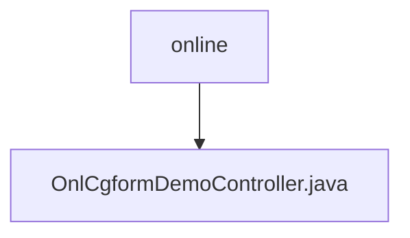

# 基础信息

|      |      |
|------|------|
| 名称 | online |
| 编码语言 | .java |
| 代码路径 | JeecgBoot/jeecg-boot/jeecg-module-demo/src/main/java/org/jeecg/modules/demo/online |
| 包名 | JeecgBoot.jeecg-boot.jeecg-module-demo.src.main.java.org.jeecg.modules.demo.online |
| 概述说明 | OnlCgformDemoController负责表单增强，涵盖列表处理、校验及修改功能。 |

# 说明

OnlCgformDemoController负责处理表单的增强功能，主要包括对列表数据的处理以及表单数据的校验和修改。该控制器确保表单数据的准确性和完整性，通过校验机制防止错误数据进入系统，并支持对现有表单数据的修改操作。此外，它还处理与表单相关的列表数据，确保数据的有效管理和展示。

### 包内部结构视图

该流程图展示了路径的层级关系，其中`online`文件夹包含一个文件`OnlCgformDemoController.java`。这种结构表明`online`是顶层目录，而`OnlCgformDemoController.java`是其子文件，体现了简单的文件组织方式。

# 文件列表 File List

| 名称   | 类型  | 说明 |
|-------|------|-------------|
| [OnlCgformDemoController.java](OnlCgformDemoController.md) | file | OnlCgformDemoController负责表单增强，涵盖列表处理、校验及修改功能。 |

