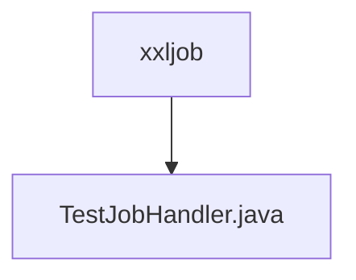

# 基础信息

|      |      |
|------|------|
| 名称 | xxljob |
| 编码语言 | .java |
| 代码路径 | JeecgBoot/jeecg-boot/jeecg-module-demo/src/main/java/org/jeecg/modules/demo/xxljob |
| 包名 | JeecgBoot.jeecg-boot.jeecg-module-demo.src.main.java.org.jeecg.modules.demo.xxljob |
| 概述说明 | 信息为空，无法生成概要描述。 |

# 说明

提供的文本内容为空，未包含任何具体信息或细节。因此，无法生成相关的总结描述。请提供具体内容以便进行准确描述。

### 包内部结构视图

该流程图展示了路径的层级关系，`xxljob` 是父目录，`TestJobHandler.java` 是其子文件。这种结构清晰地表明了文件在项目中的位置，帮助开发者快速定位和理解文件之间的关系。

# 文件列表 File List

| 名称   | 类型  | 说明 |
|-------|------|-------------|
| [TestJobHandler.java](TestJobHandler.md) | file | 信息为空，无法生成概要描述。 |

