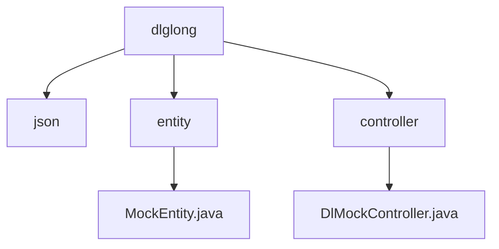

# 基础信息

|      |      |
|------|------|
| 名称 | dlglong |
| 编码语言 | .java |
| 代码路径 | JeecgBoot/jeecg-boot/jeecg-module-demo/src/main/java/org/jeecg/modules/dlglong |
| 包名 | JeecgBoot.jeecg-boot.jeecg-module-demo.src.main.java.org.jeecg.modules.dlglong |
| 概述说明 | MockEntity类含id、parentId、status字段，DlMockController实现数据更改、保存、查询及Socket通信。 |

# 说明

## 概述
该代码模块主要包含两个核心部分：`MockEntity`类和`DlMockController`控制器。`MockEntity`类用于定义和管理实体的基本结构，包括实体的唯一标识、父级实体标识以及当前状态。`DlMockController`控制器则负责模拟数据的更改、保存及查询操作，并通过Socket实现数据的实时更新和交互。这两个组件共同构成了一个模拟数据管理的模块，能够有效地处理实体的层级关系和状态信息，并通过网络通信机制实现数据的传输与同步。

## 主要业务场景
1. **实体管理**：`MockEntity`类用于管理和表示实体的层级关系和状态信息。通过`id`、`parentId`和`status`字段，能够清晰地描述实体的唯一标识、父级实体标识以及当前状态，适用于需要处理层级结构和状态管理的业务场景。

2. **数据模拟与交互**：`DlMockController`控制器通过模拟数据的更改、保存及查询操作，能够有效地模拟实际场景中的数据流。通过Socket发送消息，确保数据的实时更新和交互，适用于需要实时数据同步和网络通信的业务场景。

3. **网络通信**：`DlMockController`控制器利用Socket进行数据传输，确保数据的实时更新和交互，适用于需要通过网络进行数据同步和通信的业务场景。

### 包内部结构视图

该流程图展示了`dlglong`模块的层级结构，包含`json`、`entity`和`controller`三个子目录。其中，`entity`目录下包含`MockEntity.java`文件，`controller`目录下包含`DlMockController.java`文件。该图清晰地反映了模块内部的组织关系，便于理解代码结构。

# 文件列表 File List

| 名称   | 类型  | 说明 |
|-------|------|-------------|
| [entity](entity/_module.md) | package | MockEntity类包含id、parentId和status三个关键字段。 |
| [json](json/_module.md) | package | None |
| [controller](controller/_module.md) | package | DlMockController实现多接口，模拟数据操作并通过Socket发送消息。 |

