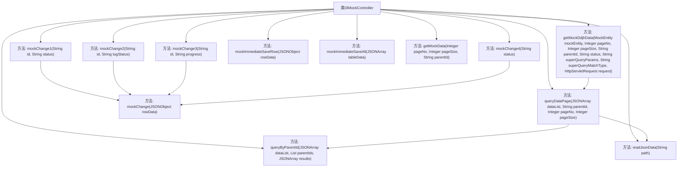

# 基础信息

|      |      |
|------|------|
| 名称 | DlMockController |
| 编码语言 | .java |
| 代码路径 | JeecgBoot/jeecg-boot/jeecg-module-demo/src/main/java/org/jeecg/modules/dlglong/controller/DlMockController.java |
| 包名 | org.jeecg.modules.dlglong.controller |
| 依赖项 | ['com.alibaba.fastjson.JSON', 'com.alibaba.fastjson.JSONArray', 'com.alibaba.fastjson.JSONObject', 'com.baomidou.mybatisplus.core.conditions.query.QueryWrapper', 'com.baomidou.mybatisplus.core.metadata.IPage', 'com.baomidou.mybatisplus.extension.plugins.pagination.Page', 'lombok.extern.slf4j.Slf4j', 'org.apache.commons.io.IOUtils', 'org.apache.commons.lang3.StringUtils', 'org.jeecg.common.api.vo.Result', 'org.jeecg.common.system.query.MatchTypeEnum', 'org.jeecg.common.system.query.QueryCondition', 'org.jeecg.common.system.query.QueryGenerator', 'org.jeecg.common.constant.VxeSocketConst', 'org.jeecg.modules.demo.mock.vxe.websocket.VxeSocket', 'org.jeecg.modules.dlglong.entity.MockEntity', 'org.springframework.web.bind.annotation', 'javax.servlet.http.HttpServletRequest', 'java.io.IOException', 'java.io.InputStream', 'java.net.URLDecoder', 'java.util'] |
| 概述说明 | DlMockController实现多接口，模拟数据操作并通过Socket发送消息。 |

# 说明

DlMockController实现了多个接口，主要用于模拟数据的更改、保存及查询操作。该控制器通过Socket发送消息，确保数据的实时更新和交互。其功能涵盖了数据管理的核心操作，能够有效地模拟实际场景中的数据流，并通过网络通信机制实现数据的传输与同步。

# 类列表 Class Summary

| 名称   | 类型  | 说明 |
|-------|------|-------------|
| DlMockController | class | DlMockController实现多个接口，模拟数据更改、保存及查询操作，通过Socket发送消息。 |

## 类 DlMockController

|      |      |
|------|------|
| 访问范围 | @Slf4j;@RestController;@RequestMapping("/mock/dlglong");public |
| 类型 | class |
| 名称 | DlMockController |
| 说明 | DlMockController实现多个接口，模拟数据更改、保存及查询操作，通过Socket发送消息。 |

### UML类图

```mermaid
classDiagram
    class DlMockController {
        <<RestController>>
        +Result mockChange1(String id, String status)
        +Result mockChange2(String id, String tugStatus)
        +Result mockChange3(String id, String progress)
        +Result mockChange4(String status)
        +Result mockImmediateSaveRow(JSONObject rowData)
        +Result mockImmediateSaveAll(JSONArray tableData)
        +Result getMockData(Integer pageNo, Integer pageSize, String parentId)
        +Result getMockDdjhData(MockEntity mockEntity, Integer pageNo, Integer pageSize, String parentId, String status, String superQueryParams, String superQueryMatchType, HttpServletRequest request)
        -void mockChange(JSONObject rowData)
        -IPage~JSONObject~ queryDataPage(JSONArray dataList, String parentId, Integer pageNo, Integer pageSize)
        -void queryByParentId(JSONArray dataList, List~String~ parentIds, JSONArray results)
        -JSONArray readJsonData(String path)
    }

    class Result {
        <<Interface>>
        +static Result ok()
        +static Result error(String message)
    }

    class JSONObject {
        +void put(String key, Object value)
        +String toJSONString()
    }

    class JSONArray {
        +void addAll(JSONArray array)
        +JSONObject getJSONObject(int index)
        +int size()
    }

    class VxeSocket {
        <<Interface>>
        +static String packageMessage(String type, JSONObject data)
        +static void sendMessageToAll(String message)
    }

    class VxeSocketConst {
        <<Interface>>
        +static String TYPE_UVT
        +static String TYPE_CSD
    }

    class MockEntity {
        +String id
        +String status
    }

    class QueryWrapper~T~ {
        +String getCustomSqlSegment()
    }

    class QueryGenerator {
        <<Interface>>
        +static QueryWrapper~T~ initQueryWrapper(T entity, Map~String, String[]~ parameterMap)
    }

    class QueryCondition {
        +String field
        +String value
    }

    class MatchTypeEnum {
        <<Interface>>
        +static MatchTypeEnum getByValue(String value)
        +String getValue()
    }

    DlMockController --> Result : 依赖
    DlMockController --> JSONObject : 依赖
    DlMockController --> JSONArray : 依赖
    DlMockController --> VxeSocket : 依赖
    DlMockController --> VxeSocketConst : 依赖
    DlMockController --> MockEntity : 依赖
    DlMockController --> QueryWrapper~MockEntity~ : 依赖
    DlMockController --> QueryGenerator : 依赖
    DlMockController --> QueryCondition : 依赖
    DlMockController --> MatchTypeEnum : 依赖
```

类图描述：
`DlMockController` 是一个 Spring Boot 的 REST 控制器，用于处理与模拟数据相关的请求。它依赖于 `Result` 类来返回操作结果，并使用 `JSONObject` 和 `JSONArray` 来处理 JSON 数据。`VxeSocket` 和 `VxeSocketConst` 用于封装和发送 WebSocket 消息。`MockEntity` 是一个实体类，用于封装请求参数。`QueryWrapper` 和 `QueryGenerator` 用于构建查询条件，`QueryCondition` 和 `MatchTypeEnum` 用于处理高级查询条件。

### 内部方法调用关系图

该流程图展示了 `DlMockController` 类中的各个方法及其调用关系。`mockChange1`、`mockChange2`、`mockChange3` 和 `mockChange4` 方法都调用了 `mockChange` 方法来处理数据更改。`getMockDdjhData` 方法调用了 `queryDataPage` 方法进行数据分页查询，而 `queryDataPage` 方法又调用了 `queryByParentId` 和 `readJsonData` 方法来处理数据查询和读取。整体流程展示了从请求处理到数据操作的完整路径。

### 字段列表 Field List

| 名称  | 类型  | 说明 |
|-------|-------|------|

### 方法列表 Method List

| 名称  | 类型  | 说明 |
|-------|-------|------|
| mockChange1 | Result | 通过ID和状态参数模拟更改行数据并返回成功结果。 |
| mockChange | void | mockChange方法封装socket数据并发送给所有在线用户。 |
| readJsonData | JSONArray | 从指定路径读取JSON数据并解析为数组。 |
| mockChange4 | Result | 接口模拟状态变更，封装socket数据并发送给所有在线用户。 |
| mockImmediateSaveAll | Result | 即时保存接口，仅处理新增数据，避免重复更新，模拟网络延迟1.5秒。 |
| getMockData | Result | GET请求获取分页数据，支持父级ID筛选，读取JSON文件并返回结果。 |
| mockChange2 | Result | 通过id和tug_status模拟更改行数据，调用VXESocket.sendMessageToAll()发送消息。 |
| queryByParentId | void | 递归查询父ID匹配的子数据并合并结果。 |
| mockChange3 | Result | 接口mockChange3通过id和progress参数模拟更改行数据，并返回成功结果。 |
| getMockDdjhData | Result | 获取模拟数据，处理查询条件，计算拖轮状态并返回分页结果。 |
| queryDataPage | IPage<JSONObject> | 根据父级ID查询子级数据并模拟分页，返回不含子节点的分页结果。 |
| mockImmediateSaveRow | Result | 接口模拟即时保存行数据，延时500毫秒返回成功。 |

