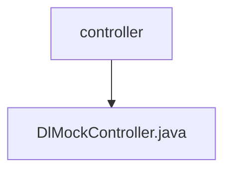

# 基础信息

|      |      |
|------|------|
| 名称 | controller |
| 编码语言 | .java |
| 代码路径 | JeecgBoot/jeecg-boot/jeecg-module-demo/src/main/java/org/jeecg/modules/dlglong/controller |
| 包名 | JeecgBoot.jeecg-boot.jeecg-module-demo.src.main.java.org.jeecg.modules.dlglong.controller |
| 概述说明 | DlMockController实现多接口，模拟数据操作并通过Socket发送消息。 |

# 说明

DlMockController实现了多个接口，主要用于模拟数据的更改、保存及查询操作。该控制器通过Socket发送消息，确保数据的实时更新和交互。其功能涵盖了数据管理的核心操作，能够有效地模拟实际场景中的数据流，并通过网络通信机制实现数据的传输与同步。

### 包内部结构视图

该流程图展示了路径的层级关系，`controller`文件夹下包含一个名为`DlMockController.java`的文件。这种结构清晰地反映了文件在项目中的位置，有助于开发者快速定位和管理相关代码文件。

# 文件列表 File List

| 名称   | 类型  | 说明 |
|-------|------|-------------|
| [DlMockController.java](DlMockController.md) | file | DlMockController实现多接口，模拟数据操作并通过Socket发送消息。 |

