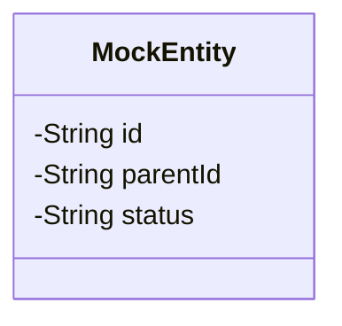
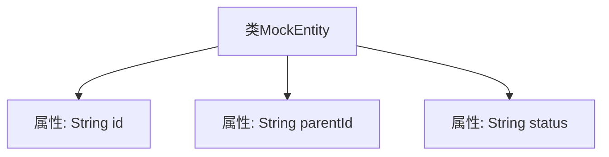

# 基础信息

|      |      |
|------|------|
| 名称 | MockEntity |
| 编码语言 | .java |
| 代码路径 | JeecgBoot/jeecg-boot/jeecg-module-demo/src/main/java/org/jeecg/modules/dlglong/entity/MockEntity.java |
| 包名 | org.jeecg.modules.dlglong.entity |
| 依赖项 | ['lombok.Data'] |
| 概述说明 | MockEntity类包含id、parentId和status三个关键字段。 |

# 说明

MockEntity类是一个包含三个关键字段的实体类，这些字段分别是id、parentId和status。id字段用于唯一标识该实体，parentId字段用于表示该实体的父级实体标识，status字段则用于描述该实体的当前状态。这三个字段共同构成了MockEntity类的基本结构，使其能够有效地管理和表示实体的层级关系和状态信息。

# 类列表 Class Summary

| 名称   | 类型  | 说明 |
|-------|------|-------------|
| MockEntity | class | MockEntity类包含id、parentId和status三个关键字段。 |

## 类 MockEntity

|      |      |
|------|------|
| 访问范围 | @Data;public |
| 类型 | class |
| 名称 | MockEntity |
| 说明 | MockEntity类包含id、parentId和status三个关键字段。 |

### UML类图

这段代码定义了一个名为 `MockEntity` 的类，该类包含三个私有字段：`id`、`parentId` 和 `status`。这些字段分别用于存储实体的唯一标识符、父级实体的标识符以及实体的状态。类使用了 `@Data` 注解，这意味着它可能自动生成了 getter、setter、`toString`、`equals` 和 `hashCode` 等方法，但代码中未明确展示这些方法。该类可能用于模拟或测试场景，作为数据实体的一部分。

### 内部方法调用关系图

这段代码定义了一个名为`MockEntity`的类，该类包含三个属性：`id`、`parentId`和`status`。这些属性分别用于存储实体的唯一标识符、父级实体的标识符以及实体的状态信息。代码使用了`@Data`注解，这通常意味着该类会自动生成getter、setter、toString等方法，从而简化了代码的编写和维护。流程图清晰地展示了类与其属性之间的层级关系。

### 字段列表 Field List

| 名称  | 类型  | 说明 |
|-------|-------|------|
| status | String | 定义私有字符串变量status。 |
| id | String | 定义一个私有的字符串类型变量id。 |
| parentId | String | 私有字符串变量parentId。 |

### 方法列表 Method List

| 名称  | 类型  | 说明 |
|-------|-------|------|

