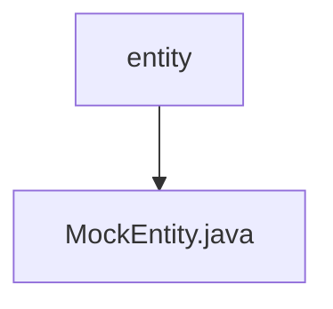

# 基础信息

|      |      |
|------|------|
| 名称 | entity |
| 编码语言 | .java |
| 代码路径 | JeecgBoot/jeecg-boot/jeecg-module-demo/src/main/java/org/jeecg/modules/dlglong/entity |
| 包名 | JeecgBoot.jeecg-boot.jeecg-module-demo.src.main.java.org.jeecg.modules.dlglong.entity |
| 概述说明 | MockEntity类包含id、parentId和status三个关键字段。 |

# 说明

MockEntity类是一个包含三个关键字段的实体类，这些字段分别是id、parentId和status。id字段用于唯一标识该实体，parentId字段用于表示该实体的父级实体标识，status字段则用于描述该实体的当前状态。这三个字段共同构成了MockEntity类的基本结构，使其能够有效地管理和表示实体的层级关系和状态信息。

### 包内部结构视图

描述：该流程图展示了路径的层级关系，其中`entity`文件夹包含一个名为`MockEntity.java`的文件。`entity`是根节点，`MockEntity.java`是其子节点，表示文件位于该文件夹内。

# 文件列表 File List

| 名称   | 类型  | 说明 |
|-------|------|-------------|
| [MockEntity.java](MockEntity.md) | file | MockEntity类包含id、parentId和status三个关键字段。 |

