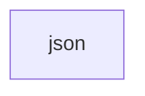

# 基础信息

|      |      |
|------|------|
| 名称 | json |
| 编码语言 | .java |
| 代码路径 | JeecgBoot/jeecg-boot/jeecg-module-demo/src/main/java/org/jeecg/modules/dlglong/json |
| 包名 | JeecgBoot.jeecg-boot.jeecg-module-demo.src.main.java.org.jeecg.modules.dlglong.json |
| 概述说明 | None |

# 说明

None

### 包内部结构视图

描述：该流程图展示了路径的最终层级关系。路径的最后一级元素为“json”，表示这是一个文件夹或文件，没有进一步的子目录或文件。

# 文件列表 File List

| 名称   | 类型  | 说明 |
|-------|------|-------------|

